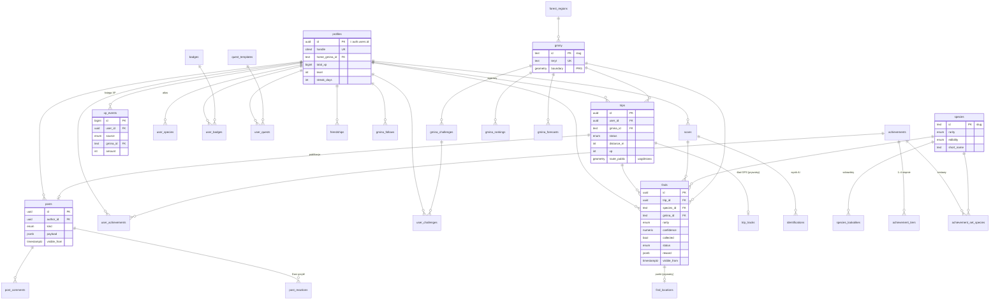

# Backend – Supabase (Postgres + PostGIS)

Schemat: [`supabase/migrations/20261005120000_init.sql`](../supabase/migrations/20261005120000_init.sql) +
[`20261006100000_achievements.sql`](../supabase/migrations/20261006100000_achievements.sql) (osiągnięcia) ·
słowniki: [`supabase/seed.sql`](../supabase/seed.sql) (generowany z mocków: `npm run db:seed`) ·
test bez Dockera: `npm run db:test` (Postgres 17 + PostGIS w WASM, 55 sprawdzeń pętli z makiety i osiągnięć).

## Architektura

```
Aplikacja Expo (iOS / Android)
  │  supabase-js: Auth · select (RLS) · rpc(...) · Storage upload
  ▼
Supabase
  ├─ Auth            Sign in with Apple / Google, e-mail OTP
  ├─ Postgres        tabele + RLS + logika gry w funkcjach SQL (XP, odznaki, osiągnięcia, zadania, rankingi)
  │   └─ PostGIS     granice gmin (PRG) → gmina z GPS, uogólnianie tras
  ├─ Storage         scan-photos (prywatny), post-media, avatars
  ├─ Edge Function   identify: zdjęcia skanu → model AI → identifications + finds (pending)
  └─ pg_cron         refresh_gmina_rankings() co godzinę, prognozy grzybowe raz dziennie
```

Zasada: **klient nie liczy XP**. Aplikacja wywołuje `claim_find`, a serwer zwraca gotową rozpiskę
do ekranu Nagroda (ten sam kształt co `Find.reward` w `src/types.ts`).

## Model danych



| Grupa | Tabele |
|---|---|
| Słowniki (publiczne) | `species`, `species_lookalikes`, `gminy`, `forest_regions`, `badges` (z regułą `rule jsonb`), `achievements` (metryka + `params`), `achievement_tiers`, `achievement_set_species`, `quest_templates`, `gmina_challenges`, `gmina_forecasts`, `gmina_rankings` |
| Gracz | `profiles`, `friendships`, `gmina_follows`, `push_tokens` |
| Wyprawa | `trips`, `trip_tracks` 🔒, `scans`, `identifications`, `finds`, `find_locations` 🔒 |
| Progres | `xp_events` (księga – źródło prawdy), `user_species` (atlas), `user_badges`, `user_achievements` (nagrodzone stopnie), `user_quests`, `user_challenges` |
| Feed | `posts`, `post_reactions`, `post_comments` |

🔒 = widzi tylko właściciel, nigdy nie trafia do statystyk ani feedu.

## Osiągnięcia

Lustro `src/utils/achievements.ts`: 24 osiągnięcia, 48 stopni (brąz → platyna), słownik w `seed.sql`
generowany z definicji aplikacji (`npm run db:seed`) – te same slugi, progi, XP i teksty celów.

- Postęp nie jest zapisywany – `achievement_value(user, achievement)` liczy go z `user_species` (atlas)
  i `finds` (okazy XXL). `user_achievements.tier` = liczba **nagrodzonych** stopni.
- `claim_find` po aktualizacji atlasu wywołuje `sync_achievements`: każdy nowy stopień to wpis w `xp_events`
  (źródło `achievement`, `ref_id` = `kolekcjoner:2`), a nagroda ma `unlockedAchievements: [{id, tier, xp}]` –
  ten sam kształt co `Find.reward` w aplikacji. XP stopni nie wchodzi w `levelAfter` (jak zadania dnia).
- `seed_achievements(user)` – już osiągnięte stopnie jako nagrodzone, bez XP (seed uruchamia je dla istniejących
  profili, więc wdrożenie nie zasypie graczy XP).
- RLS: słownik publiczny; zdobyte stopnie (`user_achievements`) widzą zalogowani jak odznaki; postęp (pochodna atlasu)
  tylko własny przez `achievement_progress()`. Zapis wyłącznie przez funkcje serwera.

Nowe osiągnięcie: dopisz je w `ACHIEVEMENTS` w aplikacji, `npm run db:seed`, a gdy potrzebna nowa metryka – wartość
w enumie `achievement_metric` i gałąź w `achievement_value` (nowa migracja).

## Prywatność (wymóg produktowy)

- Surowy ślad GPS (`trip_tracks`) i punkt znaleziska (`find_locations`) – RLS: tylko właściciel.
- Publicznie istnieje wyłącznie `trips.route_public`: trasa uproszczona i przyciągnięta do siatki ~200 m.
- `finds.visible_from = koniec wyprawy + 24 h` – dopiero wtedy znalezisko liczy się w statystykach gminy
  (`species_percentile`, `gmina_stats`, `gmina_records`); rankingi biorą XP starsze niż 24 h.
- `posts.visible_from = publikacja + 24 h` – autor widzi wpis od razu, inni dopiero później.
- Statystyki publiczne to wyłącznie agregaty (funkcje `SECURITY DEFINER`), nigdy pojedyncze rekordy z lokalizacją.

## RPC dla aplikacji

| Funkcja | Ekran / akcja |
|---|---|
| `gmina_at(lon, lat)` | 01 – „Wykryto region” (współrzędne nie są zapisywane) |
| `start_trip(gmina_id)` | 01 – „Rozpocznij grzybobranie” (seria dni, odznaka „Ranny ptaszek”) |
| `report_trip_progress(trip_id, distance_m)` | w tle co ~1 min – zadanie „Przejdź 5 km”, odznaka „100 km” |
| `claim_find(find_id)` | 03 → 04 – XP, atlas, odznaki, osiągnięcia, zadania, wyzwania, LEVEL UP |
| `achievement_progress()` | 08 – „Osiągnięcia x / Y”: wartość, zdobyty i nagrodzony stopień, następny próg |
| `finish_trip(trip_id, distance_m, duration_s, track_geojson)` | 01 – „Zakończ wyprawę” |
| `publish_trip(trip_id, hide_route, title)` | 05 – „Opublikuj w feedzie” |
| `get_feed(scope, before, limit)` · `toggle_reaction(post_id)` | 09 |
| `species_percentile(...)` | 03 / 04 – „Większy niż 88% okazów w gminie” |
| `gmina_stats` · `gmina_records` · `gmina_species_share` | 07 |
| `select * from gmina_rankings` | 06 |

Mapowanie na interfejsy aplikacji (`src/services/types.ts`):

| Serwis | Implementacja Supabase |
|---|---|
| `LocationService` | `expo-location` + `gmina_at`, dystans → `report_trip_progress` |
| `ScanService` | `expo-camera` → upload do `scan-photos/{user}/{scan}/…` → `insert into scans` |
| `IdentifyService` | Edge Function `identify` (zapisuje `identifications` i `finds` jako `pending`) |
| `StatsService` | `gmina_stats`, `gmina_records`, `gmina_species_share`, `gmina_rankings`, `species_percentile` |
| `FeedService` | `get_feed`, `publish_trip`, `toggle_reaction` |
| `CatalogService` | `select` ze słowników (cache w aplikacji) |
| `store/game.ts → claimFind` | `claim_find` |

## Lokalnie (Docker) – telefon w tej samej sieci Wi-Fi

```bash
npx supabase start
```

Pierwszy start wgrywa `supabase/migrations` i `supabase/seed.sql`. Nowa migracja na działającej bazie (bez kasowania
danych): `npx supabase migration up --local`, a słowniki (seed jest idempotentny):
`docker exec -i supabase_db_grzybobranie psql -U postgres -d postgres < supabase/seed.sql`. Panel bazy (Studio): `http://<IP komputera>:54323`.
Aplikacja przełącza się na bazę przez `.env.local` (wzór w `.env.example`):
`EXPO_PUBLIC_BACKEND=supabase`, `EXPO_PUBLIC_SUPABASE_URL=http://<IP komputera>:54321` i klucz publishable z `npx supabase status`.
Po zmianie `.env.local` zrestartuj `npx expo start`. Bez dostępu do bazy aplikacja wraca do mocków; status połączenia
jest w panelu `/dev` → „Backend”.

Etap 1 (zrobiony): anonimowe konto + słowniki (gatunki z sobowtórami, odznaki, zadania) z bazy.
Etap 2: akcje gry przez RPC (`start_trip`, `claim_find`, `finish_trip`, `publish_trip`), feed i statystyki z bazy.

## Wdrożenie

```bash
npx supabase login
```

```bash
npx supabase init
```

```bash
npx supabase link --project-ref <ref-projektu>
```

```bash
npx supabase db push --include-seed
```

Potem w Dashboard → Database → Extensions włącz `pg_cron` i uruchom raz:

```sql
select cron.schedule('rankingi-gmin', '7 * * * *', $$select public.refresh_gmina_rankings()$$);
```

### Granice gmin (PRG)

Seed ma gminy bez granic (`boundary`) i kodów TERYT. Granice: Państwowy Rejestr Granic z Geoportalu (GUGiK),
warstwa gmin (układ EPSG:2180). Import przez `ogr2ogr` do tabeli tymczasowej, potem
`update gminy set boundary = st_multi(st_transform(geom, 4326)), teryt = … from prg_tmp where …`
(dopasowanie po nazwie i powiecie). Bez granic `gmina_at` zwraca `null` – aplikacja może wtedy zapytać
o gminę ręcznie.

## Testy schematu

`npm run db:test` wgrywa migrację i seed do PGlite (atrapy `auth` i `storage` z Supabase) i sprawdza m.in.:
rozpiskę 250 XP i „Króla Puszczy” z makiety, idempotentność `claim_find`, gatunek trujący i niską pewność,
brak możliwości dopisania sobie XP, RLS na cudzych wyprawach i śladzie GPS, opóźnienie 24 h w feedzie,
znajomych, „Darz grzyb!”, statystyki gminy, ranking, `gmina_at` i LEVEL UP, a dla osiągnięć: stopnie bez XP
na start, „Znam wroga” i „Epicka kolekcja” przy `claim_find`, wpis w księdze, idempotentność, brak zapisu
i wywołań funkcji wewnętrznych przez klienta oraz parytet z aplikacją (atlas startowy → 20 / 48 stopni).
