# Backend – Supabase (Postgres + PostGIS)

Schemat: [`supabase/migrations/20261005120000_init.sql`](../supabase/migrations/20261005120000_init.sql) +
[`20261006100000_achievements.sql`](../supabase/migrations/20261006100000_achievements.sql) (osiągnięcia) +
[`20261007100000_game_sync.sql`](../supabase/migrations/20261007100000_game_sync.sql) (etap 2: synchronizacja stanu gry) +
[`20261008100000_social.sql`](../supabase/migrations/20261008100000_social.sql) (etap 3: feed, znajomi, aktywność) +
[`20261009100000_stats.sql`](../supabase/migrations/20261009100000_stats.sql) (etap 4: rankingi województw, statystyki gmin, wyzwania) +
[`20261010100000_storage.sql`](../supabase/migrations/20261010100000_storage.sql) (etap 5: zdjęcia w Storage) +
[`20261011100000_account.sql`](../supabase/migrations/20261011100000_account.sql) (etap 6: konto e-mail, regulamin, blokowanie,
eksport i usunięcie konta) +
[`20261012100000_anticheat.sql`](../supabase/migrations/20261012100000_anticheat.sql) (etap 7: anty-cheat – limity, wiarygodność, dziennik flag) ·
słowniki: [`supabase/seed.sql`](../supabase/seed.sql) (generowany z mocków i indeksu PRG: `npm run db:seed`) ·
test bez Dockera: `npm run db:test` (Postgres 17 + PostGIS w WASM, 325 sprawdzeń: pętla z makiety, osiągnięcia, synchronizacja,
feed i znajomi, rankingi i statystyki gmin, ścieżki zdjęć i polityki Storage, regulamin, blokady, eksport i usunięcie konta, anty-cheat).

## Architektura

```
Aplikacja Expo (iOS / Android)
  │  supabase-js: Auth · select (RLS) · rpc(...) · Storage upload
  ▼
Supabase
  ├─ Auth            konto anonimowe → zabezpieczenie e-mailem i logowanie kodem OTP (etap 6); później Apple / Google
  ├─ Postgres        tabele + RLS + logika gry w funkcjach SQL (XP, odznaki, osiągnięcia, zadania, rankingi)
  │   └─ PostGIS     granice gmin (PRG) → gmina z GPS, uogólnianie tras
  ├─ Storage         scan-photos (prywatny), post-media i avatars (publiczne) – upload z aplikacji do {user_id}/…
  ├─ Edge Function   identify: zdjęcie skanu → Claude (Anthropic API) → wynik rozpoznania dla aplikacji (limit 60 / 24 h);
  │                  znalezisko zapisuje dalej submit_find z kolejki (podpis wyniku – do zrobienia)
  │                  delete-account: usunięcie konta przez Admin API (etap 6, niewdrożona)
  └─ pg_cron         refresh_gmina_rankings() co godzinę (rankingi odświeżają się też przy odczycie), prognozy raz dziennie
```

Zasada: **klient nie liczy XP**. Aplikacja wywołuje `claim_find`, a serwer zwraca gotową rozpiskę
do ekranu Nagroda (ten sam kształt co `Find.reward` w `src/types.ts`).

Aplikacja jest **local-first**: ekran reaguje od razu na stanie lokalnym (także offline w lesie), a akcje gry
trafiają do kolejki (outbox) wysyłanej, gdy jest sieć. Serwer jest źródłem prawdy – po synchronizacji aplikacja
pobiera `get_game_state()` i przyjmuje ten stan (szczegóły: [Etap 2](#etap-2--stan-gry-na-serwerze-outbox)).

## Model danych

```mermaid
erDiagram
  profiles ||--o{ trips : "wyprawy"
  profiles ||--o{ scans : ""
  profiles ||--o{ finds : ""
  profiles ||--o{ xp_events : "księga XP"
  profiles ||--o{ user_species : "atlas"
  profiles ||--o{ user_badges : ""
  profiles ||--o{ user_achievements : ""
  profiles ||--o{ user_quests : ""
  profiles ||--o{ user_challenges : ""
  profiles ||--o{ friendships : ""
  profiles ||--o{ gmina_follows : ""
  profiles ||--o{ posts : ""
  profiles ||--o{ user_blocks : "blokady"
  profiles ||--o{ user_terms_acceptances : "regulamin"
  trips ||--o| trip_tracks : "ślad GPS (prywatny)"
  trips ||--o{ finds : ""
  trips ||--o| posts : "publikacja"
  scans ||--o{ identifications : "wynik AI"
  scans ||--o{ finds : ""
  finds ||--o| find_locations : "punkt (prywatny)"
  species ||--o{ finds : ""
  species ||--o{ species_lookalikes : "sobowtóry"
  gminy ||--o{ trips : ""
  gminy ||--o{ finds : ""
  gminy ||--o{ gmina_challenges : ""
  gminy ||--o{ gmina_rankings : ""
  gminy ||--o{ gmina_forecasts : ""
  forest_regions ||--o{ gminy : ""
  badges ||--o{ user_badges : ""
  achievements ||--o{ achievement_tiers : "1–4 stopnie"
  achievements ||--o{ achievement_set_species : "zestawy"
  achievements ||--o{ user_achievements : ""
  species ||--o{ achievement_set_species : ""
  quest_templates ||--o{ user_quests : ""
  gmina_challenges ||--o{ user_challenges : ""
  posts ||--o{ post_reactions : "Darz grzyb!"
  posts ||--o{ post_comments : ""
  posts ||--o{ post_hides : "ukryte"
  posts ||--o{ post_reports : "zgłoszenia"

  profiles {
    uuid id PK "= auth.users.id"
    citext handle UK
    text avatar_path "avatars/…"
    text home_gmina_id FK
    bigint total_xp
    int level
    int streak_days
  }
  trips {
    uuid id PK
    uuid user_id FK
    text gmina_id FK
    enum status
    int distance_m
    int xp
    geometry route_public "uogólniona"
  }
  finds {
    uuid id PK
    uuid trip_id FK
    text species_id FK
    text gmina_id FK
    enum rarity
    numeric confidence
    bool collected
    enum status
    jsonb reward
    text photo_path "scan-photos/…"
    timestamptz visible_from
  }
  species {
    text id PK "slug"
    enum rarity
    enum edibility
    text short_name
    numeric season_weights "12 wag I–XII"
    text habitats "iglasty, laka…"
    text protection "scisla / czesciowa"
  }
  gminy {
    text id PK "slug"
    text teryt UK
    enum kind "miejska / wiejska / miejsko-wiejska"
    numeric forest_pct "lesistość %"
    geometry boundary "PRG"
  }
  posts {
    uuid id PK
    uuid author_id FK
    enum kind
    jsonb payload "cover_path → post-media/…"
    timestamptz visible_from
  }
  xp_events {
    bigint id PK
    uuid user_id FK
    enum source
    text gmina_id FK
    int amount
  }
```



| Grupa | Tabele |
|---|---|
| Słowniki (publiczne) | `species`, `species_lookalikes`, `gminy`, `forest_regions`, `badges` (z regułą `rule jsonb`), `achievements` (metryka + `params`), `achievement_tiers`, `achievement_set_species`, `quest_templates` (pula: `period` dzienne / tygodniowe, `difficulty`, `params`), `gmina_challenges` (stałe + tygodniowe `week_start`), `gmina_forecasts`, `gmina_rankings` (miejsca w kraju i w województwie) |
| Gracz | `profiles` (+ `terms_version`, `terms_accepted_at`, `onboarded_at`, `deleted_at` – etap 6), `friendships`, `gmina_follows`, `push_tokens`, `user_blocks` (etap 6), `user_terms_acceptances` (etap 6) |
| Wyprawa | `trips`, `trip_tracks` 🔒, `scans`, `identifications`, `finds`, `find_locations` 🔒 |
| Progres | `xp_events` (księga – źródło prawdy), `user_species` (atlas), `user_badges`, `user_achievements` (nagrodzone stopnie), `user_quests`, `user_challenges` |
| Feed | `posts`, `post_reactions`, `post_comments`, `post_hides` (własne), `post_reports` 🚫 |
| Konfiguracja / serwer | `app_config` 🚫 (np. `dev_tools`), `gmina_rankings_refresh` 🚫 (kiedy przeliczono rankingi), `dev_bot_activity` 🚫 (generator botów), `anti_cheat_flags` 🚫 (dziennik anty-cheatu – etap 7) |

🔒 = widzi tylko właściciel, nigdy nie trafia do statystyk ani feedu. 🚫 = bez dostępu dla klientów (tylko funkcje serwera).

## Katalog gatunków (treść, ochrona)

Migracja `20261013100000_species_content.sql`; treść z `src/data/mock/species.ts` (360 gatunków) przez `npm run db:seed`
(upsert – poprawki katalogu wchodzą przy kolejnym seedzie; `atlas_no` tylko przy wstawieniu). Źródła:
[species-sources.md](species-sources.md).

| Kolumna | Typ | Znaczenie |
|---|---|---|
| `species.season_weights` | `numeric[]` | 12 wag I–XII, 0..1, szczyt = 1 (`Species.seasonWeights`) – check: 12 elementów w zakresie |
| `species.habitats` | `text[]` | siedliska, pierwsze najczęstsze: `iglasty`, `lisciasty`, `mieszany`, `laka`, `drewno`, `torfowisko`, `park` |
| `species.protection` | `text` | `scisla` / `czesciowa` / null – rozporządzenie MŚ z 9.10.2014 (Dz.U. 2014 poz. 1408) |
| `species.description` | `text` | opis karty gatunku (cechy rozpoznawcze, ostrzeżenia) |
| `species_lookalikes.sort` | `smallint` | kolejność sobowtórów; 0 = główny (`Species.lookalike` w aplikacji) |

- Sobowtórów może być kilka na gatunek (klucz `(species_id, lookalike_name)`); seed usuwa wiersze gatunków z katalogu,
  których nie ma już w aplikacji. `lookalike_id` (powiązanie z gatunkiem z katalogu) seed ustawia **tylko dla głównego**
  sobowtóra – metryka `lookalike_pairs` liczy wtedy te same pary co aplikacja (`Species.lookalike`).
- Aplikacja (`fetchSpecies`) czyta nowe kolumny i wszystkie sobowtóry (sortuje po `sort`).
- **Gatunek chroniony = tylko zdjęcie:** `submit_find` zapisuje `collected = false` dla trujących, śmiertelnych **i chronionych**;
  `claim_find` przy `collected = false` daje „Zdjęcie gatunku trującego (½ bazy)” albo – gdy gatunek jest chroniony (także
  chroniony i trujący) – „Zdjęcie gatunku chronionego (½ bazy)” + „Zostawiony w lesie – gatunek chroniony” +30 XP
  (lustro `computeFindXp`), dalej „Nowy gatunek w atlasie”. Idempotentność bez zmian (drugie wywołanie zwraca zapisaną
  nagrodę).
- Generator aktywności (`dev_seed_activity`) i boty nadal liczą `collected` tylko z jadalności – do poprawki przy
  następnej zmianie generatora.

## Osiągnięcia

Lustro `src/utils/achievements.ts`: 67 osiągnięć, 249 stopni (brąz → srebro → złoto → platyna → **diament**), słownik
w `seed.sql` generowany z definicji aplikacji (`npm run db:seed`) – te same slugi, progi, XP, medale i teksty celów.
Migracje: `20261006100000_achievements.sql` (atlas) + `20261013110000_progression.sql` (diamenty, liczniki, zadania).

- Postęp nie jest zapisywany. `player_metrics(user)` liczy RAZ wszystkie liczniki gracza (jsonb, klucze = wartości
  enumu `achievement_metric`, snake_case jak `counterSqlKey` w aplikacji): znaleziska (rzadkie/epickie/legendarne,
  XXL, zdjęcia trujących, poza gminą domową, pory roku i miesiące – czas Europe/Warsaw, sekretne: 11:11, piątek 13.,
  noc, Wigilia, ten sam gatunek z rzędu), wyprawy (zakończone, najdłuższa trasa i czas, starty przed 6:00,
  znaleziska na wyprawie, dni w lesie, najdłuższa seria dni), odkrywca (gminy, województwa, kompleksy leśne –
  listy), społeczność (`post_reactions` dane i otrzymane, `post_comments`, `friendships` accepted, wpisy z wypraw),
  wyzwania (`user_challenges`, `user_quests` wg okresu). `achievement_value(user, a, metrics)` – atlas (`user_species`)
  albo wartość z metryk (lista → długość). `user_achievements.tier` = liczba **nagrodzonych** stopni (1–5).
- `sync_achievements(user)` nagradza nowe stopnie (wpis w `xp_events`, źródło `achievement`, `ref_id` = `seria-dni:5`).
  Wołają ją: `claim_find` (nagroda ma `unlockedAchievements: [{id, tier, xp}]` – kształt `Find.reward`; XP stopni nie
  wchodzi w `levelAfter`), a od progresji także wyzwalacze: start wyprawy przed 6:00, koniec wyprawy (`finish_trip`,
  auto-zamknięcie), publikacja (`posts`), reakcja (`post_reactions` – dający i **odbiorca**), komentarz
  (`post_comments`), akceptacja znajomości (`friendships` – obie strony). Boty deweloperskie są pomijane.
- `seed_achievements(user)` – już osiągnięte stopnie (także nowych osiągnięć i nowych stopni platyny / diamentu) jako
  nagrodzone, bez XP; seed uruchamia ją dla istniejących profili, więc wdrożenie nie zasypie graczy XP.
- `get_game_state().counters` = `player_metrics` – aplikacja przyjmuje liczniki z serwera (cała historia; okno 30 wypraw
  dawało tylko dolne oszacowanie), a postęp osiągnięć liczy z nich lokalnie jak w trybie mock.
- RLS: słownik publiczny; zdobyte stopnie (`user_achievements`) i odznaki – wprost z tabeli tylko własne (od
  [uszczelnień](#uszczelnienia-anty-cheatu)); postęp tylko własny przez `achievement_progress()`. Zapis wyłącznie przez
  funkcje serwera; `player_metrics` / `sync_achievements` wewnętrzne.

Nowe osiągnięcie: dopisz je w `ACHIEVEMENTS` w aplikacji i `npm run db:seed`. Nowa metryka licznika: pole
w `PlayerCounters` (aplikacja), wartość w enumie `achievement_metric` i klucz w `player_metrics()` (nowa migracja).

### Zadania dnia i tygodnia (rotacja)

- `quest_templates`: `period` (`daily` | `weekly`), `difficulty` (1–3), `params` (`speciesId`, `months` – sezon gatunku
  z `seasonWeights` ≥ 0,5, `minutes`, `beforeHour`), `kind` (enum `quest_kind`: skany, rzadki, epicki, dystans, gatunek,
  czas wyprawy, nowy gatunek, zdjęcie trującego, poza gminą domową, XXL, jadalne, różne gatunki, publikacja, reakcje,
  start przed 7:00, liczba wypraw). Pula = `QUEST_POOL` z aplikacji (seed: 38 szablonów, 13 tygodniowych), `sort` =
  kolejność puli.
- `quests_for(user, day)` → 3 dzienne + 3 tygodniowe (tydzień od poniedziałku, `week_start`): hash
  `(h·31 + znak) mod (2³¹−1)` z „user|dzień|d” / „user|poniedziałek|w”, generator Parka–Millera, bez dwóch zadań tego
  samego rodzaju, dziennie najpierw jedno łatwe, sezonowe tylko w swoich miesiącach – identycznie jak `selectQuests`
  w aplikacji (db:test porównuje oba dla wielu graczy i dat). Tryb makiety: `set_config('app.quests_design', 'on')`
  przy `dev_tools` → stałe zadania z makiety (testy).
- Postęp: `bump_quest` liczy tylko wylosowane zadania, dzień zadania tygodniowego = poniedziałek (`user_quests.day`).
  Skany i rzadkie – pętla w `claim_find`; dystans – `credit_trip_distance` (dzienny i tygodniowy); pozostałe rodzaje –
  wyzwalacze (`finds` → claimed przed aktualizacją atlasu, `trips` start/koniec, `posts`, `post_reactions` – liczba
  różnych cudzych wpisów z reakcją w okresie, więc cofanie i ponowienie nie nabija). `completedQuestIds` w nagrodzie
  z serwera wymienia tylko zadania z pętli `claim_find` (aplikacja pokazuje swoje).
- `get_game_state().quests`: `day`, `progress` (wylosowane zadania dnia), `daily` (ich id), `week`, `weekly` (zadania
  tygodnia z postępem).

## Prywatność (wymóg produktowy)

- Surowy ślad GPS (`trip_tracks`) i punkt znaleziska (`find_locations`) – RLS: tylko właściciel. Od
  [uszczelnień](#uszczelnienia-anty-cheatu) `finish_trip` śladu z telefonu nie zapisuje, a `publish_trip` nie publikuje trasy
  (`route: null`, `route_precision = 'gmina'`) – `trips.route_public` zostaje tylko w danych sprzed zmiany (eksport RODO).
- Bezpośredni odczyt tabel `profiles`, `posts`, `user_badges`, `user_achievements` – tylko własne wiersze; cudze dane wyłącznie
  przez RPC (blokady, `deleted_at`, ukrycie w wyszukiwarce).
- `finds.visible_from = koniec wyprawy + 24 h` – dopiero wtedy znalezisko liczy się w statystykach gminy
  (`get_gmina_stats`, `get_species_percentile`, rekordy w `get_ranking`); rankingi biorą XP starsze niż 24 h.
  Wyjątek: `userContribution` w `get_ranking` – własne XP gracza bez opóźnienia.
- `posts.visible_from = publikacja + 24 h` – autor widzi wpis od razu, inni dopiero później.
- Statystyki publiczne to wyłącznie agregaty (funkcje `SECURITY DEFINER`), nigdy pojedyncze rekordy z lokalizacją.
- Szanse na gatunki i mapa gatunku (etap 8): k-anonimowość – gatunek w zbiorach gminy i gmina na mapie gatunku tylko przy
  ≥ 2 różnych znalazcach, zbiory gminy w ogóle przy ≥ 3 znalazcach i ≥ 5 znaleziskach w oknie (inaczej pusta odpowiedź).
- RODO (etap 6): gracz pobiera wszystkie swoje dane (`export_my_data` – także ślad GPS i punkty znalezisk) i usuwa konto z danymi
  (`delete_my_account`); blokada drugiej osoby ukrywa treści w obie strony.

## RPC dla aplikacji

| Funkcja | Ekran / akcja |
|---|---|
| `gmina_at(lon, lat)` | 01 – „Wykryto region” (współrzędne nie są zapisywane) |
| `start_trip(gmina_id, trip_id?, started_at?)` | 01 – „Rozpocznij grzybobranie” (seria dni, odznaka „Ranny ptaszek”) |
| `report_trip_progress(trip_id, distance_m)` | w tle co ~1 min – zadanie „Przejdź 5 km”, odznaka „100 km” |
| `submit_find(…)` | 02 → 03 – wynik rozpoznania z telefonu (**tymczasowe**, do czasu Edge Function `identify`) |
| `discard_find(find_id)` | 03 – „Odrzuć” |
| `claim_find(find_id)` | 03 → 04 – XP, atlas, odznaki, osiągnięcia, zadania, wyzwania, LEVEL UP |
| `achievement_progress()` | 08 – „Osiągnięcia x / Y”: wartość, zdobyty i nagrodzony stopień, następny próg |
| `finish_trip(trip_id, distance_m, duration_s, track_geojson?, ended_at?)` | 01 – „Zakończ wyprawę” |
| `get_game_state()` | po synchronizacji kolejki – stan gry z serwera (profil, atlas, odznaki, osiągnięcia, liczniki `counters`, zadania dnia i tygodnia, wyprawy, znaleziska) |
| `dev_import_state(state)` · `dev_reset_player()` | panel `/dev` – tylko lokalnie (`app_config.dev_tools`) |
| `publish_trip(trip_id, hide_route, title, cover_path?)` | 05 – „Opublikuj w feedzie” (z okładką z `post-media`) |
| `set_find_photo(find_id, path)` · `set_post_cover(post_id, path)` | zdjęcie znaleziska / okładka wpisu po uploadzie (szczegóły: [Etap 5](#etap-5--zdjęcia-w-storage)) |
| `get_feed(scope, before, limit)` · `get_post` · `toggle_reaction(post_id)` · komentarze · ukrywanie · zgłoszenia | 09 (szczegóły: [Etap 3](#etap-3--feed-znajomi-i-aktywność)) |
| `search_users` · `get_friends` · `get_user` · `send_friend_request` · `respond_friend_request` · `remove_friend` | znajomi, mini profil |
| `get_activity(since, limit)` | powiadomienia w aplikacji |
| `dev_seed_social()` · `dev_bots_act()` | panel `/dev` – boty (tylko lokalnie) |
| `get_species_percentile(species_id, gmina_id, weight_g)` | 03 / 04 – „Większy niż 88% okazów w gminie” |
| `get_gmina_stats(gmina_id)` · `accept_challenge(challenge_id)` · `follow_gmina(gmina_id, follow)` | 07 (szczegóły: [Etap 4](#etap-4--rankingi-i-statystyki-gmin)) |
| `get_ranking(period, voivodeship?)` | 06 – ranking i mapa województwa |
| `get_gmina_species_evidence(gmina_id, days?)` · `get_species_map(species_id, voivodeship?, period?)` | 07 – „Szanse na wyprawie”, Start – „Najbardziej prawdopodobne tu”, karta gatunku – „Sezon i występowanie” (szczegóły: [Etap 8](#etap-8--szanse-na-gatunki-i-mapa-gatunku)) |
| `dev_seed_activity(voivodeship?, weeks?)` · `dev_refresh_rankings()` | panel `/dev` – ciche boty z historią znalezisk (tylko lokalnie) |
| ~~`species_percentile` · `gmina_stats` · `gmina_records` · `gmina_species_share`~~ | usunięte w [uszczelnieniach](#uszczelnienia-anty-cheatu) – aplikacja używa RPC etapu 4 |
| `accept_terms(p_version)` · `complete_onboarding()` | onboarding – akceptacja regulaminu (szczegóły: [Etap 6](#etap-6--konto-e-mail-kod-otp-regulamin-blokowanie-eksport-i-usunięcie)) |
| `block_user` · `unblock_user` · `get_blocked_users` | „Zablokuj” w mini profilu, Ustawienia → „Zablokowani” |
| `export_my_data()` · `prepare_account_deletion()` · `delete_my_account()` | Ustawienia → „Pobierz moje dane”, „Usuń konto” (RODO) |
| supabase-js `auth.updateUser({ email })` / `signInWithOtp` + `verifyOtp` | Ustawienia → „Zabezpiecz konto e-mailem”, „Zaloguj się na innym telefonie” |
| `admin_flags(p_limit, p_min_severity)` · widok `anti_cheat_summary` | tylko `service_role` / Studio – moderacja flag anty-cheatu (szczegóły: [Etap 7](#etap-7--anty-cheat-wykrywanie-dziennik-blokada-tylko-nadużyć)) |
| `identify_begin(p_user)` · `identify_finish(…)` · widok `identify_usage` | tylko `service_role` – limit i koszty Edge Function `identify` (szczegóły: [Rozpoznawanie](#rozpoznawanie--edge-function-identify)) |

Mapowanie na interfejsy aplikacji (`src/services/types.ts`):

| Serwis | Implementacja Supabase |
|---|---|
| `LocationService` | `expo-location` + `gmina_at`, dystans → `report_trip_progress` |
| Zdjęcie skanu | `expo-camera` → `expo-image-manipulator` (bez EXIF) → upload do `scan-photos/{user}/{find}.jpg` → `set_find_photo` |
| `IdentifyService` | Edge Function `identify` (zdjęcie → Claude → gatunek / „nie grzyb” / „niewyraźne”), wynik do `submit_find` z kolejki – także w trybie mock (sama funkcja) |
| `StatsService` | `get_gmina_stats`, `get_ranking`, `get_species_percentile` (+ `accept_challenge`, `follow_gmina`; stan w `get_game_state`), `get_gmina_species_evidence` → model szans w telefonie, `get_species_map` |
| `FeedService` | `get_feed`, `get_post`, `publish_trip` (+ okładka w `post-media`, `set_post_cover`), `toggle_reaction`, `get_comments` / `add_comment` / `delete_comment`, `hide_post` / `unhide_posts` / `get_hidden_posts`, `report_post` |
| Znajomi / profil innych | `search_users`, `get_friends`, `get_user`, `get_user_by_handle`, `send_friend_request`, `respond_friend_request`, `remove_friend` |
| Powiadomienia (w aplikacji) | `get_activity` |
| Konto (etap 6) | Auth: `signInAnonymously` → `updateUser({ email })` + `verifyOtp('email_change')`; logowanie `signInWithOtp` + `verifyOtp('email')`; RPC `accept_terms`, `complete_onboarding`, `export_my_data`, `prepare_account_deletion`, `delete_my_account` (+ Edge Function `delete-account`) |
| Blokady (etap 6) | `block_user`, `unblock_user`, `get_blocked_users`; `"blocked"` w grzybiarzu |
| `CatalogService` | `select` ze słowników (cache w aplikacji) |
| `store/game.ts → claimFind` | `claim_find` |
| `store/game.ts` (stan gry) | kolejka zdarzeń → RPC z tabeli Etapu 2, potem `get_game_state()` |

## Etap 2 – stan gry na serwerze (outbox)

Migracja [`20261007100000_game_sync.sql`](../supabase/migrations/20261007100000_game_sync.sql). Aplikacja zostaje
local-first: akcja od razu zmienia stan lokalny i trafia do kolejki (outbox) z identyfikatorami (uuid) i czasami
wygenerowanymi na telefonie. Gdy jest sieć, kolejka idzie do serwera **po kolei** (jedno wywołanie naraz), a na końcu
aplikacja pobiera `get_game_state()` i przyjmuje stan z serwera (XP, poziom, atlas, odznaki… liczy wyłącznie serwer).
Zdarzenia mogą dojść późno (offline) albo dwa razy (retry po timeoucie), więc każde RPC jest idempotentne:

| RPC | Idempotencja i czas z telefonu |
|---|---|
| `start_trip(p_gmina_id text, p_trip_id uuid = null, p_started_at timestamptz = null) → trips` | Ta sama `p_trip_id` → ta sama wyprawa bez zmian. Inna aktywna: bez `p_trip_id` → zwraca aktywną (np. z `claim_find`), z `p_trip_id` → stara jest zamykana (jak `finish_trip`, koniec = start nowej) i powstaje nowa. `started_at` z telefonu (> 5 min w przyszłość → `now()`). Seria dni z daty startu (Europe/Warsaw), tylko do przodu – spóźniona synchronizacja jej nie cofa. |
| `report_trip_progress(p_trip_id uuid, p_distance_m int) → trips` | Dystans narastająco (mniejszy niż zapisany nic nie zmienia). Wyprawa już zamknięta → zwraca ją bez błędu. |
| `submit_find(p_find_id uuid, p_trip_id uuid, p_gmina_id text, p_species_id text, p_rarity rarity, p_confidence numeric, p_xxl boolean, p_dimensions jsonb, p_candidates jsonb, p_parts text[], p_found_at timestamptz) → finds` | **Tymczasowe** – patrz niżej. Ten sam `p_find_id` → istniejące znalezisko. |
| `discard_find(p_find_id uuid) → void` | Oczekujące → `discarded`; odebrane, nieznane, cudze, ponowne → nic. |
| `claim_find(p_find_id uuid) → jsonb` | Bez zmian: drugi raz zwraca zapisaną nagrodę. Znalezisko bez wyprawy dostaje aktywną (albo nową). |
| `finish_trip(p_trip_id uuid, p_distance_m int, p_duration_s int, p_track_geojson text = null, p_ended_at timestamptz = null) → trips` | Wyprawa zakończona / opublikowana → zwraca ją bez zmian. `ended_at = p_ended_at` przycięty do `[started_at, now()]`. Uszkodzony / zbyt krótki ślad jest pomijany (nie blokuje kolejki). |
| `get_game_state() → jsonb` | Odczyt – tylko dane wywołującego. |

Błędy: `P0001` (reguła / walidacja, np. `unknown_gmina`, `invalid_found_at`, `find_discarded`, `low_confidence`,
`trip_id_conflict`, `find_id_conflict`, od etapu 7 `rate_limited`), `P0002` (brak wyprawy / znaleziska), `28000` (brak sesji) – stałe,
nie ponawiać (zdarzenie z kolejki odrzucić i przyjąć stan z serwera). Błąd sieci / timeout, `40P01` (zakleszczenie) – ponowić.
Etap 7: `submit_find` poprawia `rarity` / `xxl` (prawda serwera), a `report_trip_progress` / `finish_trip` mogą uznać mniejszy dystans
niż zgłoszony – szczegóły w [Etapie 7](#etap-7--anty-cheat-wykrywanie-dziennik-blokada-tylko-nadużyć).

**`submit_find` (tymczasowe).** Aplikacja przysyła wynik rozpoznania z Edge Function `identify` (dawniej – z mocka; serwer
go jeszcze nie podpisuje); serwer zapisuje `scans` (`identified`), `identifications` (`provider = 'client-sim'`, `model = 'mock-v1'`) i `finds`
(`pending`, `collected = false` dla gatunków trujących, śmiertelnych i chronionych – [Katalog gatunków](#katalog-gatunków-treść-ochrona)). `p_dimensions`: `{cap_cm, height_cm, weight_g,
age_days, pieces}`, `p_candidates`: `[{species_id, confidence}]`. Wyprawa nieznana serwerowi / cudza → `trip_id = null`
(`claim_find` podepnie aktywną). Walidacja (`P0001`, kod w treści, opis w `detail`): gatunek i gmina istnieją, pewność 0–1,
wymiary liczbowe i wiarygodne (kapelusz ≤ 80 cm, wysokość ≤ 100 cm, waga ≤ 10 000 g, wiek ≤ 365 dni, sztuk ≤ 200),
`found_at` najwyżej 14 dni wstecz i 5 min w przód. Po wdrożeniu `identify` funkcję usuwamy – klient nie będzie podawał
gatunku ani wymiarów.

**`get_game_state()`** – camelCase, liczby jako liczby JSON, czasy jak `Date.toISOString()` (`…T08:15:00.000Z`),
daty `YYYY-MM-DD`, tablice nigdy `null`:

```jsonc
{
  "userId": "uuid", "serverTime": "2026-10-07T08:15:00.000Z",
  "profile": { "handle", "displayName", "firstName", "homeGminaId", "totalXp", "level", "xpInLevel", "streakDays",
               "lastActiveDate": "2026-10-07" | null, "tripsCount", "mushroomsCount", "totalDistanceM",
               "avatarPath": "<uid>/avatar-….jpg" | null,                         // avatarPath – etap 5
               "termsVersion": "2026-10-07" | null, "termsAcceptedAt": "…Z" | null, "onboardedAt": "…Z" | null },  // etap 6
  "atlas": [{ "speciesId", "count", "firstFoundAt", "bestCapCm", "bestWeightG" }],
  "badges": ["krol-puszczy"],
  "achievements": { "kolekcjoner": 2 },                       // nagrodzone stopnie
  "quests": { "day": "2026-10-07", "progress": [{ "questId", "progress", "completed" }] },   // wszystkie aktywne zadania, postęp z dziś
  "trips": [{ "id", "gminaId", "status", "startedAt", "endedAt", "durationS", "distanceM", "xp", "hideRoute" }],  // aktywna + 30 ostatnich, od najnowszej
  "finds": [{ "id", "tripId", "speciesId", "gminaId", "rarity", "confidence", "xxl", "capCm", "heightCm", "weightG",
              "ageDays", "pieces", "collected", "status", "foundAt", "xp", "reward",
              "photoPath": "<uid>/<findId>.jpg" | null }],  // pending | claimed tych wypraw + pending bez wyprawy; photoPath – etap 5
  // etap 4:
  "challenges": [{ "id", "gminaId", "title", "speciesId", "description", "xp", "badgeId", "badgeName", "endsAt" | null,
                   "acceptedAt", "completedAt" | null }],   // ukończone przyjęte w 30 dniach + nieukończone, które wciąż trwają
  "followedGminy": ["suprasl"]                               // od najwcześniej obserwowanej
}
```

**Narzędzia deweloperskie** (panel `/dev`) działają tylko, gdy `app_config.dev_tools = true` – inaczej `P0001 dev_tools_disabled`.
`app_config` nie ma polityk ani uprawnień dla klientów; flagę ustawia wyłącznie seed lokalny (`npm run db:seed`).
**W chmurze `dev_tools` nie może być `true`** (patrz [Wdrożenie](#wdrożenie)); sprawdzenie: `select public.dev_tools_enabled()`.
Od [uszczelnień](#uszczelnienia-anty-cheatu) migracje nie nadają klientom EXECUTE na `dev_*` – nadaje je tylko seed lokalny.

- `dev_import_state(p_state jsonb) → jsonb` – przenosi lokalny stan aplikacji na serwer: kasuje dane gry wywołującego
  (wyprawy, znaleziska ze skanami i rozpoznaniami, księgę XP, atlas, odznaki, osiągnięcia, zadania, wyzwania, wpisy) i wgrywa
  `{"profile": {displayName, firstName, handle, homeGminaId, level, xpInLevel, streakDays, tripsCount, mushroomsCount},
  "atlas": [{speciesId, count, firstFoundAt, bestCapCm, bestWeightG}], "badges": ["id"]}`. XP to jeden wpis w księdze
  (źródło `import`) = suma progów do `(level, xpInLevel)` (ta sama krzywa co `level_from_total_xp`; `xpInLevel` przycinane
  do progu poziomu). Nick: bez wiodącego „@”, małymi literami, gdy wolny i zgodny z `^[a-z0-9._]{3,24}$` – inaczej zostaje obecny.
  Nieznane gatunki / odznaki / gmina są pomijane. `last_active_date` = dziś. Osiągnięcia: `seed_achievements` (stopnie z atlasu
  nagrodzone bez XP). Zwraca `get_game_state()`.
- `dev_reset_player() → jsonb` – to samo kasowanie i świeży gracz Lv 1 (nick, imię, gmina domowa i gotowy avatar `avatar_preset`
  zostają) + dane społecznościowe (etap 3: znajomi i zaproszenia, ukryte wpisy, zgłoszenia, własne komentarze i reakcje); zwraca
  `get_game_state()` + (etap 5) `"storagePaths": {"scan-photos": [...], "post-media": [...], "avatars": [...]}` – pliki gracza do
  usunięcia przez aplikację (SQL nie kasuje plików): zdjęcia znalezisk, okładki wpisów, zdjęcie profilowe; `avatar_path` jest czyszczony.

**Wszystkie gminy z PRG.** Aplikacja wykrywa na telefonie każdą z 2479 gmin (indeks `assets/geo/gminy-index.geo`), więc seed
ma je wszystkie (`id` = slug z aplikacji, `teryt`, `name`, `voivodeship`, `powiat`, `kind`, `forest_pct`) – FK
`trips.gmina_id` / `finds.gmina_id` działają dla prawdziwego GPS. Gminy z danymi gry (38 z makiety) zachowują kompleks leśny
i pozycję na siatce. Granic (`boundary`) w seedzie nie ma – patrz [Granice gmin](#granice-gmin-prg).

## Etap 3 – feed, znajomi i aktywność

Migracja [`20261008100000_social.sql`](../supabase/migrations/20261008100000_social.sql). Wszystkie odczyty zwracają **jsonb
w camelCase** (jak `get_game_state`), czasy jak `Date.toISOString()`, tablice nigdy `null`. Wszystkie RPC tylko dla
zalogowanych (`authenticated`); bez sesji `28000`.

**Widoczność wpisu** (jedna reguła dla feedu, wpisu, komentarzy, reakcji, ukrywania i zgłoszeń): własny zawsze, cudzy dopiero
od `visible_from` (publikacja + 24 h), usunięty (`deleted_at`) nigdy. Niewidoczny → `P0002 post_not_found`.

**Znajomi dwustronni.** Jeden wiersz `friendships` na parę (unikalny indeks na `least/greatest`): `user_id` zaprasza,
`friend_id` akceptuje; `accepted_at` ustawia trigger (także przy bezpośrednim `UPDATE status` przez zaproszonego).
Zaproszenie „w drugą stronę” = akceptacja. RLS bez zmian: zaakceptować może tylko zaproszony.

Wspólne kształty JSON:

```jsonc
// autor / pozycja listy (handle bez „@”; name = display_name, gdy pusta – handle)
{ "id", "handle", "name", "level", "avatarPreset": "sowa" | null,
  "avatarPath": "<id>/avatar-….jpg" | null,                                       // etap 5: zdjęcie profilowe (koszyk avatars)
  "ringRarity": "pospolity" | "rzadki" | "epicki" | "legendarny" | "primary" }   // najrzadsze ODEBRANE znalezisko, brak → primary
// grzybiarz (social user) = autor +
{ "homeGminaId", "tripsCount", "mushroomsCount", "friendStatus": "none" | "friends" | "outgoing" | "incoming",
  "blocked": false }                                                               // etap 6: czy JA zablokowałem tego gracza
// wpis
{ "id", "kind": "trip" | "levelup", "author": {…}, "gminaId", "tripId" | null, "routePrecision": "gmina" | "approximate",
  "payload": {…},            // bez zmian – jak zapisał publish_trip ({title, distance_km, duration_min, mushrooms, species, xp,
                             //   highlight: {rarity, species, weight_g, cap_cm} | null, route: GeoJSON | null, cover_path}) albo claim_find ({level, badge_name?})
  "coverPath": "<authorId>/<tripId>-….jpg" | null,   // etap 5: okładka (koszyk post-media) = payload.cover_path
  "reactions", "comments", "reacted", "mine", "createdAt", "publishedAt", "visibleFrom" }
// komentarz
{ "id", "postId", "author": {…}, "text", "createdAt", "mine" }
// aktywność
{ "id", "kind": "reaction" | "comment" | "friend_request" | "friend_accepted", "actor": {…autor}, "postId" | null,
  "text" | null, "createdAt" }
```

| RPC | Opis |
|---|---|
| `get_feed(p_scope text = 'friends', p_before timestamptz = null, p_limit int = 20) → jsonb` | Wpisy od najnowszego. `friends` = własne + zaakceptowani znajomi (w obie strony), `gmina` = wpisy w gminie domowej gracza (brak gminy → `[]`). Bez usuniętych i ukrytych przez gracza. Stronicowanie: `p_before` = `createdAt` ostatniego wpisu. `p_limit` 1–50. Inny zakres → `P0001 invalid_scope`. |
| `get_post(p_post_id uuid) → jsonb` | Wpis; niewidoczny → `P0002 post_not_found`. |
| `toggle_reaction(p_post_id uuid, out reacted boolean, out reactions int)` | „Darz grzyb!” – przełącznik (PostgREST zwraca obiekt `{reacted, reactions}`); niewidoczny wpis → `P0002`. |
| `get_comments(p_post_id uuid) → jsonb` | Komentarze od najstarszego; niewidoczny wpis → `P0002`. |
| `add_comment(p_post_id uuid, p_text text, p_comment_id uuid = null) → jsonb` | Komentarz (tekst obcięty z odstępów, 1–280 znaków, inaczej `P0001 invalid_comment`). Idempotentny po `p_comment_id` (uuid z telefonu): ponowienie zwraca zapisany; id cudzego / spod innego wpisu → `P0001 comment_id_conflict`. |
| `delete_comment(p_comment_id uuid) → void` | Tylko własny; cudzy / nieistniejący → nic. |
| `hide_post(p_post_id uuid) → void` · `unhide_posts(p_post_ids uuid[] = null) → void` · `get_hidden_posts() → jsonb` | Ukrywanie wpisu w swoim feedzie (idempotentne; niewidoczny → `P0002`); `null` = przywróć wszystkie; lista ukrytych od ostatnio ukrytego. |
| `report_post(p_post_id uuid, p_comment_id uuid = null, p_reason text = null) → void` | Zgłoszenie wpisu albo komentarza; idempotentne (raz na gracza i wpis / komentarz). Powód > 500 znaków → `P0001 invalid_reason`; komentarz spoza wpisu → `P0002 comment_not_found`. |
| `publish_trip(p_trip_id uuid, p_hide_route boolean, p_title text = null, p_cover_path text = null) → posts` | Idempotentne, zwraca wiersz `posts`. Bez śladu GPS (`route_public`) → `route: null`, `route_precision = 'gmina'`. Etap 5: okładka `p_cover_path` → `payload.cover_path` (patrz [Etap 5](#etap-5--zdjęcia-w-storage)). |
| `search_users(p_query text = '', p_limit int = 20) → jsonb` | Grzybiarze po nicku / nazwie / imieniu – bez wielkości liter i polskich znaków (`unaccent`; „lukasz” → „Łukasz”), „@” i separatory `. _ -` bez znaczenia. Pusta fraza → propozycje: ta sama gmina domowa, potem najaktywniejsi (`trips_count`), bez obecnych znajomych. Zawsze bez wywołującego i bez profili `listed = false` (ciche boty generatora – etap 5); boty z `dev_seed_social` są. `p_limit` 1–50. |
| `get_friends() → jsonb` | `{"friends": [...] (wg nazwy), "incoming": [...], "outgoing": [...] (od najnowszego)}`. |
| `get_user(p_user_id uuid) → jsonb` | Grzybiarz + `"speciesCount"` (liczba gatunków w atlasie; atlas zostaje prywatny); brak → `P0002 user_not_found`. |
| `get_user_by_handle(p_handle text) → jsonb` | Jak `get_user` (z `speciesCount`), nick z „@” lub bez, bez wielkości liter; brak → JSON `null`. |
| `send_friend_request(p_user_id uuid) → text` | Nowy `friendStatus`: on zaprosił mnie → akceptacja `friends`; już znajomi → `friends`; już zaprosiłem → `outgoing`; inaczej nowe zaproszenie → `outgoing`. Do siebie → `P0001 invalid_user`, nieznany → `P0002 user_not_found`. |
| `respond_friend_request(p_user_id uuid, p_accept boolean) → text` | Na zaproszenie OD `p_user_id`: akceptacja → `friends`, odrzucenie (usuwa) → `none`; brak zaproszenia → obecny status. `p_accept = null` → `P0001 invalid_response`. |
| `remove_friend(p_user_id uuid) → void` | Usuwa znajomość albo zaproszenie w dowolną stronę (też „Anuluj zaproszenie”). |
| `get_activity(p_since timestamptz = null, p_limit int = 50) → jsonb` | Co **inni** zrobili mnie, od najnowszego: reakcje (`reaction:<postId>:<userId>`) i komentarze (`comment:<commentId>`, `text` ≤ 120 znaków) pod moimi wpisami, zaproszenia do mnie (`friend_request:<userId>`), przyjęte moje zaproszenia (`friend_accepted:<userId>`, czas = `accepted_at`). `p_since` → tylko `createdAt > p_since`. `p_limit` 1–100. Liczone na bieżąco (bez tabeli powiadomień), id stabilne. |

Profil: `avatar_preset` (gotowy avatar z aplikacji, `^[a-z0-9-]{1,32}$`) i `avatar_path` (zdjęcie profilowe – etap 5) klient
zmienia zwykłym `update profiles` (jak nick i nazwę). `is_bot` i `listed` – tylko serwer. Tabele: `post_hides` (RLS: tylko własne, zapis przez RPC), `post_reports` (bez dostępu dla
klientów, zapis przez `report_post`).

**Boty deweloperskie** (tylko przy `app_config.dev_tools = true`, inaczej `P0001 dev_tools_disabled`):

- `dev_seed_social() → jsonb` – raz tworzy 12 botów z puli mocków aplikacji (`src/data/mock/social.ts`: Ola_W, Marek_K, Bartek,
  Ewa.las, Kasia_P, Tomek_B, Grzybiarz77, Zosia_Kania, Jurek_z_Puszczy, Łukasz_Borowik, Gosia_Podgrzybek, MagdaLeśna) jako konta
  w `auth.users` (anonimowe, trigger tworzy profil, `is_bot = true`): poziom (wpis `import` w księdze, bez gminy – poza
  rankingami), gmina domowa, liczniki, avatar, znalezisko „obwódki” (`ringRarity` jak w mockach; bez `visible_from` – poza
  statystykami gmin), mały atlas i 1–3 wpisy sprzed 1–6 dni (pierwszy jak w makiecie feedu) z reakcjami i komentarzami innych
  botów. Boty są szukane po nicku (ponowne wywołanie ich nie dubluje); nowe wpisy, gdy bot nie ma żadnego z ostatnich 6 dni.
  Dla **wywołującego** (każdy gracz osobno, idempotentnie): 6 znajomych (Ola_W, Marek_K, Bartek, Ewa.las, Kasia_P, Tomek_B)
  i 2 zaproszenia do gracza (Zosia_Kania, Łukasz_Borowik). Zwraca stan po wywołaniu: `{"bots", "friends" (znajomi gracza),
  "incoming" (zaproszenia do gracza), "posts" (wpisy botów)}`.
- `dev_bots_act() → jsonb` – „symuluj innych”: boty przyjmują zaproszenia gracza, wpisy gracza stają się widoczne od razu
  (`visible_from = now()`), 2–3 znajomych botów reaguje i komentuje 3 ostatnie wpisy gracza (bot komentuje wpis raz, teksty
  z puli mocków bez powtórek), a gdy gracz nie ma żadnego zaproszenia – bot spoza znajomych je wysyła. Zwraca, ile zmieniono:
  `{"accepted", "visible", "reactions", "comments", "requests"}`.

Blokowanie użytkowników – [etap 6](#blokowanie) (feed, wpis, komentarze, aktywność, wyszukiwarka i znajomi uwzględniają blokady).
Dalej (wciąż mock / do zrobienia): push (Expo) dla aktywności, moderacja zgłoszeń (panel / Edge
Function), wpisy „compact” z makiety (serwer ma tylko `trip` i `levelup`), wyszukiwanie po
nazwisku (profil ma tylko imię) oraz indeks trigramowy dla `search_users` przy większej liczbie graczy.

## Etap 4 – rankingi i statystyki gmin

Migracja [`20261009100000_stats.sql`](../supabase/migrations/20261009100000_stats.sql). Odczyty zwracają jsonb w camelCase
(jak etapy 2–3), czasy jak `Date.toISOString()`, daty `YYYY-MM-DD`, tablice nigdy `null`. Tylko dla zalogowanych
(`authenticated`); bez sesji `28000`. `get_ranking` i `get_gmina_stats` mogą zapisywać (przeliczenie rankingu, wyzwanie
tygodnia) – wywołuj je zwykłym `supabase.rpc()` (POST), nie `{ get: true }`.

**Okresy** (Europe/Warsaw): tydzień od poniedziałku 00:00, sezon = rok kalendarzowy od 1 stycznia; `records` = sezon.

**Rankingi per województwo.** `refresh_gmina_rankings()` liczy punkty wszystkich gmin z XP starszych niż 24 h (tydzień
bieżący i dwa poprzednie – poprzedni domyka się po 24 h, trzeci daje mu trend – sezon i rekordy) i zapisuje w
`gmina_rankings` miejsce w kraju (`rank`) oraz w województwie (`voivodeship_rank`, `voivodeship_prev_rank`). Miejsca:
`rank()` – remis = to samo miejsce, następne pominięte (1, 2, 2, 4). **Odświeżanie przy odczycie:** gdy ostatnie
przeliczenie (`gmina_rankings_refresh`) jest starsze niż 15 min albo z innego tygodnia / sezonu, `get_ranking` /
`get_gmina_stats` przeliczają ranking od razu (kilkadziesiąt ms); równoległe odczyty czekają na jedno przeliczenie
(blokada doradcza) i sprawdzają świeżość ponownie. W chmurze zostaje cron `refresh_gmina_rankings()` (patrz
[Wdrożenie](#wdrożenie)) – tylko skraca pierwszy odczyt; lokalnie pg_cron nie jest potrzebny.

Księga XP aktualizuje profil wyzwalaczem **na instrukcję** (`xp_events_apply_stmt`, tabela przejściowa: jeden UPDATE na
gracza) – działanie jak wcześniej, ale wsadowe wstawianie (generator botów) jest wielokrotnie szybsze.

| RPC | Opis |
|---|---|
| `get_ranking(p_period ranking_period, p_voivodeship text = null) → jsonb` | `null` → województwo gminy domowej gracza, bez gminy → `podlaskie`; nazwa bez wielkości liter; nieznane → `P0001 invalid_voivodeship`. Wiersze: tylko gminy województwa z punktami w okresie, od 1. miejsca (bez limitu – województwo ma ≤ 314 gmin). |
| `get_gmina_stats(p_gmina_id text) → jsonb` | Ekran gminy w jednym wywołaniu; nieznana gmina → `P0002 gmina_not_found`. |
| `accept_challenge(p_challenge_id uuid) → void` | Idempotentne (już przyjęte → nic, także po końcu). Nieznane → `P0002 challenge_not_found`; nieaktywne / zakończone / nierozpoczęte → `P0001 challenge_inactive`. Ukończenie bez zmian: `claim_find` znaleziska tego gatunku w tej gminie przed końcem (`completedChallengeIds`, XP `challenge`, odznaka). Od [uszczelnień](#uszczelnienia-anty-cheatu): tylko gmina domowa / obserwowana (`P0001 challenge_not_allowed`), najwyżej 3 aktywne (`P0001 challenge_limit`), zalicza tylko zweryfikowane znalezisko po przyjęciu, 2 ukończenia na dobę. |
| `follow_gmina(p_gmina_id text, p_follow boolean) → void` | Idempotentne; nieznana gmina przy obserwowaniu → `P0002 gmina_not_found`, `p_follow = null` → `P0001 invalid_follow`. |
| `get_species_percentile(p_species_id text, p_gmina_id text, p_weight_g int) → jsonb` | Nieznany gatunek / gmina → `P0002 species_not_found` / `gmina_not_found`. |

```jsonc
// get_ranking
{ "period": "week" | "season" | "records", "voivodeship": "podlaskie", "periodStart": "2026-10-05",
  "computedAt": "…Z",                       // kiedy przeliczono ranking
  "rows": [{ "gminaId", "name", "kind": "miejska" | "wiejska" | "miejsko-wiejska" | null, "powiat": "białostocki" | null,
             "forest": "Puszcza Knyszyńska" | null,   // kompleks leśny (tylko gminy gry)
             "rank",                                  // miejsce w województwie
             "points",                                // XP (week, season) albo liczba okazów epickich i legendarnych (records)
             "mushroomers",                           // różni gracze z XP w gminie w okresie (records: ze znaleziskami w sezonie)
             "trend": 1 | null }],                    // tylko week: miejsce sprzed tygodnia − obecne (+ awans); nowa gmina → null
  "heat": { "suprasl": 4 },                 // 1–4: górne 20% → 4, 20–40% → 3, 40–60% → 2, reszta → 1; gmin bez punktów brak (= 0)
  "userContribution": 1840,                 // własne XP z gminą (znaleziska, zadania, wyzwania, osiągnięcia) od początku okresu, bez opóźnienia
  "userGminaId": "suprasl" | null }         // gmina domowa gracza (może być spoza województwa)

// get_gmina_stats – sezon, tylko znaleziska po visible_from
{ "gminaId", "name",
  "rank": 3 | null,                         // miejsce w tygodniowym rankingu województwa (null bez punktów)
  "mushroomers", "mushrooms",               // różni gracze, zebrane okazy
  "species",                                // gatunki (także sfotografowane trujące)
  "records": [{ "rarity", "speciesName", "weightG", "capCm" | null, "author", "foundOn": "2026-09-28" }],
                                            // najcięższy zebrany okaz w każdej rzadkości, 3 najrzadsze; author = nazwa (pusta → nick)
  "distribution": [{ "name", "pct" }],      // 4 najczęściej zbierane gatunki + "Inne" (dopełnienie do 100); brak danych → []
  "challenge": { "id", "title", "speciesId", "description", "xp", "badgeId" | null, "badgeName" | null, "endsAt" | null } | null,
  "challengeAccepted": false, "challengeCompleted": false, "followed": false }

// get_species_percentile – sezon, tylko znaleziska po visible_from
{ "speciesId", "gminaId", "collected", "mushroomers", "sizeRank", "percentile", "biggerCount" }
```

**Percentyl:** `biggerCount` = okazy cięższe od `p_weight_g`, `sizeRank = biggerCount + 1`, `percentile` = % lżejszych.
`collected = 0` (brak danych publicznych – także własne znalezisko przed upływem 24 h) → `sizeRank 1`, `biggerCount 0`,
`percentile 100`; aplikacja pokazuje wtedy stan „Pierwszy okaz w gminie w tym sezonie” zamiast paska.

**Wyzwania gmin.**
- 38 gmin gry ma **stałe** wyzwanie z makiety (seed z `buildGminaStats`: gatunek, tytuł, opis, 500 XP, odznaka „Łowca
  Legend”; odznaka spoza słownika → `null`) – bez końca (`endsAt: null`); stałe wyzwanie ma pierwszeństwo.
- Każda inna gmina dostaje leniwie (przy `get_gmina_stats`) **jedno wyzwanie na tydzień** (`week_start`, unikalne na gminę
  i tydzień; pon. 00:00 → nast. pon. 00:00): najczęściej zbierany gatunek **jadalny** w gminie w tym sezonie (dane
  publiczne), a bez danych – pospolity jadalny wybrany deterministycznie (hash gminy i tygodnia). Tytuł „Znajdź podgrzybka
  brunatnego w tym tygodniu” (biernik z `species_accusative`), opis z liczbą okazów w sezonie albo „W tym sezonie nikt
  jeszcze nie pochwalił się tu tym gatunkiem…”, XP 150 / 200 / 250 / 300 wg rzadkości gatunku, bez odznaki.
- `get_game_state().challenges`: ukończone przyjęte w ostatnich 30 dniach + nieukończone, które wciąż trwają (także stałe
  przyjęte dawno temu); nieukończone po `endsAt` są pomijane. `followedGminy` – obserwowane gminy.
  `dev_reset_player` kasuje przyjęte wyzwania gracza (jak dotąd); obserwowane gminy zostają.

**Generator aktywności** (tylko przy `app_config.dev_tools = true`, inaczej `P0001 dev_tools_disabled`):

- `dev_seed_activity(p_voivodeship text = null, p_weeks int = 8) → jsonb` – „ożyw” rankingi: województwo jak w `get_ranking`
  (`null` → gminy domowej wywołującego / podlaskie) i **zawsze także podlaskie** (makieta). Na województwo 60 cichych botów
  (`is_bot`, nick `bot<TERYT woj.>.<imię><nr>`, np. `bot20.anna01` – po nim idempotentnie; bez wpisów, reakcji i znajomych,
  poza wyszukiwarką – `listed = false` od etapu 5 – ale widać je jako autorów rekordów i w `get_user`), gmina domowa losowa w województwie (miasta ×3). Każdy bot ma 3
  ulubione gminy (lesistość², ×6 w powiecie gminy domowej) i historię **zakończonych wypraw z odebranymi znaleziskami**
  z ostatnich `p_weeks` tygodni (1–26): 0,6–3,1 wyprawy / tydzień, rano, 2 + do (4 + lesistość/6) znalezisk; gatunki wg
  rzadkości (pospolity 100, rzadki 20, epicki 4, legendarny 1 na gatunek; trujące ×0,4 – tylko zdjęcie) × popularność
  (podgrzybek, kurka, maślak, borowik…), masa wokół typowej (3% XXL), XP jak `claim_find`, `visible_from = found_at + 24 h`,
  wpis w księdze (`find`, czas = czas znaleziska). Część botów ma wyprawę w tym tygodniu starszą niż 25 h (ranking tygodnia)
  i w ostatnich 24 h (widać opóźnienie). Profil bota: liczniki wypraw / grzybów / dystansu, ostatnia aktywność, atlas – bez
  odznak i osiągnięć. Ponowne wywołanie dopisuje tylko okres od poprzedniego (`dev_bot_activity`; < 1 h → nic). Dane
  prawdziwych graczy bez zmian. Na końcu przelicza rankingi. Zwraca `{"voivodeship", "bots", "finds" (nowe), "gminy"
  (gminy województwa z aktywnością botów), "podlaskie": {…} (gdy inne województwo)}`. Czas: ok. 1 s na województwo
  (~6–7 tys. znalezisk).
- `dev_refresh_rankings() → jsonb` – przelicza rankingi od razu: `{"computedAt", "week", "season", "records"}` (liczba gmin
  z punktami w bieżących okresach w kraju).

## Etap 5 – zdjęcia w Storage

Migracja [`20261010100000_storage.sql`](../supabase/migrations/20261010100000_storage.sql). Zdjęcia robi aplikacja (migawka
skanu → zdjęcie znaleziska, zdjęcie profilowe, okładka wyprawy) i **sama** wysyła je do Storage (supabase-js, sesja gracza);
w bazie zapisuje tylko ścieżkę – przez RPC albo update profilu.

| Koszyk | Dostęp | Limit | Zawartość | Ścieżka (konwencja) | W bazie → w odczytach |
|---|---|---|---|---|---|
| `scan-photos` | prywatny – tylko właściciel (przywracanie na nowym telefonie) | 2 MB | zdjęcie znaleziska | `{uid}/{findId}.jpg` | `finds.photo_path` ← `set_find_photo` → `get_game_state().finds[].photoPath` |
| `post-media` | publiczny odczyt (feed) | 2 MB | okładka opublikowanej wyprawy | `{uid}/{tripId}-{losowe}.jpg` | `posts.payload.cover_path` ← `publish_trip(…, p_cover_path)` / `set_post_cover` → wpis: `coverPath` |
| `avatars` | publiczny odczyt | 512 KB | zdjęcie profilowe | `{uid}/avatar-{losowe}.jpg` | `profiles.avatar_path` ← `update profiles` → `avatarPath` (autor, grzybiarz, `get_game_state().profile`) |

Typy plików we wszystkich koszykach: `image/jpeg`, `image/png`, `image/webp` (decyduje `contentType` uploadu). Za duży plik →
413 „The object exceeded the maximum allowed size”, inny typ → 415 „mime type … is not supported” – stałe błędy, nie ponawiać.

**Ścieżki** (bez nazwy koszyka, tak jak w `storage.from(koszyk).upload(path, …)`): pierwszy segment = id gracza (`auth.uid()`),
dalej litery, cyfry i `. _ -` (podfoldery dozwolone, segment nie zaczyna się kropką – bez `..`), rozszerzenie `.jpg` / `.jpeg` /
`.png` / `.webp` (bez wielkości liter), najwyżej 300 znaków (`is_user_image_path`). Pilnują tego RPC (`P0001 invalid_path`) i
ograniczenia CHECK (`finds_photo_path_check`, `posts_cover_path_check`, `profiles_avatar_path_check` → `23514`) – ścieżka leży
zawsze w folderze właściciela wiersza. CHECK może sięgać do `id` tego samego wiersza, więc wyzwalacz nie jest potrzebny.

**Polityki `storage.objects`** (authenticated, wszystkie trzy koszyki): odczyt, zapis, podmiana i usunięcie tylko gdy
`(storage.foldername(name))[1] = auth.uid()` (podmiana nie przeniesie pliku do cudzego folderu). Odczyt własnych plików także
w koszykach publicznych – wymagają go `upsert` (SELECT + INSERT + UPDATE) i `remove` (SELECT + DELETE); cudzych plików nikt nie
pobierze ani nie wylistuje przez API. Publiczny odczyt `avatars` / `post-media` idzie przez publiczny URL (bez polityk):
`{EXPO_PUBLIC_SUPABASE_URL}/storage/v1/object/public/{koszyk}/{ścieżka}` (`storage.from(k).getPublicUrl(path)`).
`scan-photos` – `download(path)` albo `createSignedUrl(path, sekundy)`; publiczny URL zwraca 400.

**Prywatność – EXIF.** Aplikacja przed wysłaniem koduje zdjęcie ponownie (`expo-image-manipulator`: zmniejszenie + JPEG), co usuwa
metadane EXIF – w plikach nie ma GPS ani danych telefonu. Wysyłany jest wyłącznie ten wynik, nigdy oryginał z aparatu. Okładka
w `post-media` jest publiczna dla każdego, kto zna URL (nie tylko znajomych) – stąd losowa część nazwy; serwer nie sprawdza treści
zdjęcia (co na nim widać, wybiera gracz).

**Przepływ w aplikacji (local-first):**

1. Zdjęcie znaleziska (migawka skanu): `manipulateAsync` → plik lokalny (ekran działa od razu, także offline). Kolejka: `submit_find`
   (jak dotąd) → upload `scan-photos/{uid}/{findId}.jpg` z `upsert: true` (ponowienie po timeoucie nadpisze ten sam plik) →
   `set_find_photo(findId, path)`. Kolejność ma znaczenie: przed `submit_find` → `P0002 find_not_found` (stały – odrzucić zdarzenie).
2. Publikacja: upload okładki `post-media/{uid}/{tripId}-{losowe}.jpg` → `publish_trip(tripId, hideRoute, title, coverPath)`.
   Gdy upload się nie uda – publikacja bez okładki, a później `set_post_cover(postId, path)` (albo ponowne `publish_trip` z okładką –
   ustawia ją, gdy wpis jeszcze jej nie ma).
3. Avatar: upload `avatars/{uid}/avatar-{losowe}.jpg` (nowa nazwa przy każdej zmianie – publiczny URL nie pokaże starej wersji
   z cache) → `update profiles set avatar_path = …` → usunięcie poprzedniego pliku. `avatar_path = null` = bez zdjęcia
   (aplikacja pokazuje wtedy `avatarPreset`).
4. Nowy telefon: `get_game_state()` → `finds[].photoPath` → `download` / `createSignedUrl` ze `scan-photos`.

**Usuwanie plików** – SQL nie kasuje obiektów Storage, więc pliki usuwa aplikacja (`storage.from(k).remove(paths)` – tylko własne):
starą okładkę po `set_post_cover`, poprzedni avatar po zmianie, zdjęcie znaleziska po `set_find_photo(id, null)`, a w panelu
`/dev` – `storagePaths` z `dev_reset_player`. Usunięcie konta (etap 6): `prepare_account_deletion()` → `storagePaths`, a Edge Function
`delete-account` kasuje cały folder gracza. Pliki osierocone w inny sposób (`dev_import_state`, przerwany przepływ) zostają – do
sprzątania później (Edge Function / cron z service role: obiekty bez odwołania w bazie).

| RPC | Opis |
|---|---|
| `set_find_photo(p_find_id uuid, p_path text) → void` | Zdjęcie własnego znaleziska (`scan-photos`). Cudze / nieznane → `P0002 find_not_found`, zła ścieżka → `P0001 invalid_path` (opis w `detail`). `null` czyści. Idempotentne. |
| `publish_trip(p_trip_id uuid, p_hide_route boolean, p_title text = null, p_cover_path text = null) → posts` | Jak dotąd + okładka (`post-media`) w `payload.cover_path` (zawsze obecne, `null` bez okładki). Zła ścieżka → `P0001 invalid_path` (przed publikacją). Ponowna publikacja ustawia okładkę, gdy wpis jej nie ma; istniejącej nie podmienia. Stara wersja 3-argumentowa usunięta – wywołanie z 3 argumentami trafia w nową. |
| `set_post_cover(p_post_id uuid, p_path text) → void` | Okładka własnego, nieusuniętego wpisu – ustawia / podmienia, `null` czyści. Cudzy / usunięty / nieznany → `P0002 post_not_found`, zła ścieżka → `P0001 invalid_path`. Idempotentne. |

**Wyszukiwarka – `profiles.listed`** (domyślnie `true`, zmienia tylko serwer). Ciche boty generatora (`dev_seed_activity`, nick
`bot<TERYT woj.>.…`) mają `listed = false`: znikają z `search_users` (fraza i propozycje), a `get_user`, `get_user_by_handle`,
rekordy gmin i rankingi działają dla nich jak dotąd. Boty z `dev_seed_social` i gracze są w wyszukiwarce.

## Etap 6 – konto: e-mail (kod OTP), regulamin, blokowanie, eksport i usunięcie

Migracja [`20261011100000_account.sql`](../supabase/migrations/20261011100000_account.sql) + [`supabase/config.toml`](../supabase/config.toml)
(`[auth.email]`, szablony) + szablony e-maili [`supabase/templates/`](../supabase/templates/) + Edge Function
[`supabase/functions/delete-account`](../supabase/functions/delete-account/index.ts) (niewdrożona). RPC jak wcześniej: jsonb w camelCase,
czasy jak `Date.toISOString()`, tablice nigdy `null`, tylko `authenticated` (bez sesji `28000`). Konto anonimowe
(`signInAnonymously`) to też `authenticated` – wszystko niżej działa dla niego tak samo.

### Konto e-mail – kod OTP (bez linków i haseł)

Konfiguracja Auth (`config.toml`): `enable_anonymous_sign_ins = true`, `enable_signup = true`, `[auth.email] enable_signup = true`,
**`enable_confirmations = true`** (przy `false` GoTrue działa w trybie autoconfirm i `updateUser({ email })` przypina adres do konta
anonimowego od razu, bez kodu – ktoś mógłby „zająć” cudzy e-mail), `double_confirm_changes = true`, `otp_length = 6`,
`otp_expiry = 900` (15 min, jak w treści e-maili), `max_frequency = "1s"` (lokalnie; w chmurze 60 s). Szablony po polsku
(`[auth.email.template.*]`): `magic_link` (logowanie), `email_change` (zabezpieczenie konta / zmiana adresu), `confirmation`
(adres niepotwierdzony) – kod `{{ .Token }}` w temacie („123456 – kod logowania do Grzybobrania”) i dużą czcionką w treści, bez linków.

**A. Zabezpieczenie konta** – anonimowe → stałe; ten sam `user.id`, więc dane gry zostają bez migracji:

```ts
const { error } = await supabase.auth.updateUser({ email });          // kod (szablon email_change) na NOWY adres
// gracz wpisuje 6 cyfr z e-maila
const { data, error } = await supabase.auth.verifyOtp({ email, token, type: 'email_change' });
// data.user.email === email, data.user.is_anonymous === false, data.user.email_confirmed_at ustawione,
// data.session – nowa sesja (JWT: is_anonymous false, email); supabase-js zapisuje ją sam
```

Do weryfikacji: `user.new_email = email`, `user.email` puste, konto nadal anonimowe (`is_anonymous`). Konto anonimowe nie ma starego
adresu, więc wystarcza jeden kod. Późniejsza zmiana adresu stałego konta (`double_confirm_changes`) wysyła kody na OBA adresy –
każdy weryfikowany `type: 'email_change'`.

**B. Logowanie na innym telefonie** (konto musi już mieć potwierdzony adres – krok A):

```ts
await supabase.auth.signInWithOtp({ email, options: { shouldCreateUser: false } });   // kod (szablon magic_link)
const { data, error } = await supabase.auth.verifyOtp({ email, token, type: 'email' }); // sesja konta z A (ten sam user.id)
// dalej jak zwykle: get_game_state() → stan gry z serwera
```

Sesje na pierwszym telefonie działają dalej (wiele urządzeń naraz). Drugi telefon ma zwykle już własne konto anonimowe z pierwszego
uruchomienia – po przełączeniu zostaje osierocone: jeśli nie ma w nim nic cennego, aplikacja może je przed przełączeniem usunąć
(`delete_my_account()`); scalanie dwóch kont – do zrobienia (dziś wygrywa konto z e-mailem). Lokalna kolejka (outbox) starego konta
nie może trafić na nowe – wyczyść ją przy zmianie `user.id`.

| `verifyOtp` `type` | Po czym | Szablon |
|---|---|---|
| `email_change` | `updateUser({ email })` – przypięcie / zmiana adresu | `email_change` |
| `email` | `signInWithOtp` – logowanie (także adres jeszcze niepotwierdzony) | `magic_link` / `confirmation` |

Błędy GoTrue (`error.status`, `error.code` w supabase-js) – sprawdzone lokalnie:

| Sytuacja | Błąd | W aplikacji |
|---|---|---|
| zły / wygasły / już użyty kod, kod sprzed „Wyślij ponownie”, zły `type` | `403 otp_expired` „Token has expired or is invalid” | „Kod jest nieprawidłowy albo wygasł” |
| ponowne wysłanie przed upływem `max_frequency` | `429 over_email_send_rate_limit` | odliczanie przy „Wyślij kod ponownie” (60 s w chmurze) |
| `updateUser({ email })` – adres ma już inne konto | `422 email_exists` | „Ten adres ma już konto – zaloguj się kodem” (ścieżka B) |
| `updateUser({ email })` – zły format | `400 validation_failed` | walidacja pola |
| `signInWithOtp` z `shouldCreateUser: false` – nieznany adres | `422 otp_disabled` „Signups not allowed for otp” | „Nie znaleziono konta z tym adresem” |

**Kod lokalnie.** E-maile nie wychodzą na zewnątrz – łapie je Mailpit: http://127.0.0.1:54324 (z telefonu: `http://<IP komputera>:54324`).
API: `GET /api/v1/search?query=to:"adres@example.com"` (od najnowszego) → `GET /api/v1/message/{ID}` (`Subject`, `Text`, `HTML`);
kod = pierwsze 6 cyfr tematu. Zmiana `[auth]` / szablonów w `config.toml` wymaga restartu: `npx supabase stop` → `npx supabase start`
(dane zostają w wolumenie Dockera; bez `--no-backup` i bez `db reset`).

### Regulamin i onboarding

| RPC | Opis |
|---|---|
| `accept_terms(p_version text) → void` | Akceptacja regulaminu w wersji `p_version` (po obcięciu odstępów 1–32 znaki, inaczej `P0001 invalid_terms_version`; np. `updated` z `src/data/legal.ts`: `'2026-10-07'`). Idempotentne: ta sama wersja → bez zmian (zostaje pierwszy czas); nowa → `termsVersion` i `termsAcceptedAt` (czas serwera) w profilu + wiersz w historii `user_terms_acceptances` (RLS: odczyt własnych; dowód akceptacji każdej wersji). |
| `complete_onboarding() → void` | `onboardedAt = now()`, gdy jeszcze puste (idempotentne). Nie sprawdza regulaminu – kolejność pilnuje aplikacja. |

`get_game_state().profile` + `"termsVersion"`, `"termsAcceptedAt"`, `"onboardedAt"` (`null`, dopóki brak). Kolumny `terms_*`,
`onboarded_at` i `deleted_at` zmienia tylko serwer (bez GRANT UPDATE). Uwaga: tabela `profiles` jest czytelna dla zalogowanych
w całości (jak dotąd np. `created_at`), więc te znaczniki czasu też – zawężenie (kolumnowe GRANT SELECT) na później.
`dev_reset_player` nie rusza regulaminu ani onboardingu (kasuje blokady gracza).

### Blokowanie

Blokada działa **w obie strony**: blokujący (A) i zablokowany (B) nie widzą nawzajem swoich treści. Kto zablokował MNIE, nie jest
pokazywane wprost (`user_blocks` – RLS: tylko moje blokady); B dowie się pośrednio (profil A „nie istnieje”, zaproszenie → `blocked`).

| Gdzie | Skutek |
|---|---|
| `get_feed` (oba zakresy), `get_hidden_posts` | bez wpisów drugiej strony |
| `get_post`, `toggle_reaction`, `get_comments`, `add_comment`, `hide_post`, `report_post` | wpis drugiej strony → `P0002 post_not_found` (jedna reguła widoczności – `post_visible_to`) |
| komentarze pod wpisami (`get_comments`) i licznik `comments` we wpisie | bez komentarzy drugiej strony (także pod własnymi wpisami); komentarze zostają w bazie i inni je widzą |
| `get_activity` | bez reakcji, komentarzy i zaproszeń drugiej strony |
| `search_users` (fraza i propozycje) | bez drugiej strony |
| `get_user` / `get_user_by_handle` | A widzi B z `"blocked": true`; B dostaje `P0002 user_not_found` / `null` (jak nieistniejący) – chyba że B też zablokował A |
| `send_friend_request` | `P0001 blocked` w obie strony |
| znajomi | `block_user` usuwa znajomość i zaproszenia w obie strony; nowa relacja nie powstanie (wyzwalacz pomija także bezpośredni INSERT / UPDATE `friendships`); odblokowanie jej nie przywraca |
| RLS `posts`, `post_comments`, `post_reactions` | bezpośredni `select` (poza RPC) też bez treści drugiej strony; od [uszczelnień](#uszczelnienia-anty-cheatu) wprost tylko własne wpisy oraz komentarze / reakcje własne i pod własnymi wpisami (`private.blocked_with_me()` – schemat poza PostgREST) |

Bez zmian: licznik reakcji (reakcje są anonimowe), rankingi i rekordy gmin (agregaty; autor rekordu to nazwa). Tabela `profiles` –
od [uszczelnień](#uszczelnienia-anty-cheatu) wprost tylko własny wiersz (cudze profile przez RPC z blokadami).

| RPC | Opis |
|---|---|
| `block_user(p_user_id uuid) → void` | Idempotentne. Do siebie / `null` → `P0001 invalid_user`; nieznany (albo konto w trakcie usuwania) → `P0002 user_not_found`. |
| `unblock_user(p_user_id uuid) → void` | Idempotentne (brak blokady / nieznany → nic). |
| `get_blocked_users() → jsonb` | Moje blokady od ostatniej: `[{ …autor (id, handle, name, level, avatarPreset, avatarPath, ringRarity), "blocked": true, "blockedAt": "…Z" }]`. |

Grzybiarz (`search_users`, `get_friends`, `get_user`, `get_user_by_handle`) ma nowy klucz `"blocked"` (czy JA zablokowałem).

### Eksport danych (RODO art. 15 i 20)

`export_my_data() → jsonb` – wszystko o wywołującym, do zapisania jako plik `.json` (np. `grzybobranie-eksport-2026-10-07.json`
przez udostępnianie systemowe). Z danych innych graczy tylko publiczne nicki (znajomi, blokady); cudze komentarze i reakcje pod moimi
wpisami – tylko liczniki. Bez pól wewnętrznych (`is_bot`, `listed`, `deleted_at`, surowa odpowiedź i koszt modelu). Zdjęcia – jako
ścieżki (pliki pobiera aplikacja z własnego folderu Storage, jeśli eksport ma je zawierać).

```jsonc
{ "format": "grzybobranie-export-v1", "exportedAt": "…Z", "userId": "uuid",
  "account": { "email" | null, "isAnonymous", "emailConfirmedAt", "createdAt", "lastSignInAt" },   // z auth.users
  "profile": { "handle", "displayName", "firstName", "avatarPreset", "avatarPath", "homeGminaId", "totalXp", "level", "xpInLevel",
               "streakDays", "lastActiveDate", "tripsCount", "mushroomsCount", "totalDistanceM", "termsVersion", "termsAcceptedAt",
               "onboardedAt", "createdAt", "updatedAt" },
  "termsAcceptances": [{ "version", "acceptedAt" }],
  "trips": [{ "id", "gminaId", "status", "startedAt", "endedAt", "durationS", "distanceM", "xp", "hideRoute",
              "routePublic": GeoJSON | null, "track": GeoJSON | null /* surowy ślad – prywatny, ale to dane gracza */, "createdAt" }],
  "finds": [{ "id", "tripId", "scanId", "speciesId", "gminaId", "rarity", "confidence", "xxl", "capCm", "heightCm", "weightG", "ageDays",
              "pieces", "collected", "status", "xp", "reward", "personalRecord", "photoPath",
              "location": { "lon", "lat", "accuracyM" } | null /* dokładny punkt */, "foundAt", "claimedAt", "visibleFrom", "createdAt" }],
  "scans": [{ "id", "tripId", "status", "parts", "photoPaths", "createdAt",
              "identifications": [{ "id", "provider", "model", "speciesId", "confidence", "candidates", "dimensions", "createdAt" }] }],
  "xpLedger": [{ "source", "refId", "gminaId", "amount", "createdAt" }],          // suma = profile.totalXp
  "atlas": [{ "speciesId", "count", "firstFoundAt", "bestCapCm", "bestWeightG", "bestFindId" }],
  "badges": [{ "badgeId", "earnedAt", "findId" }], "achievements": [{ "achievementId", "tier", "unlockedAt", "findId" }],
  "quests": [{ "questId", "day", "progress", "completedAt" }],
  "challenges": [{ "challengeId", "gminaId", "title", "speciesId", "acceptedAt", "completedAt", "findId" }],
  "followedGminy": [{ "gminaId", "createdAt" }], "pushTokens": [{ "token", "platform", "createdAt" }],
  "friendships": [{ "handle", "status": "friends" | "outgoing" | "incoming", "createdAt", "acceptedAt" }],
  "blocks": [{ "handle", "createdAt" }],                                          // tylko MOJE blokady
  "posts": [{ "id", "kind", "tripId", "gminaId", "routePrecision", "payload", "reactions", "comments", "createdAt", "publishedAt",
              "visibleFrom", "deletedAt" }],                                       // także usunięte (deleted_at) – wciąż w bazie
  "comments": [{ "id", "postId", "text", "createdAt" }], "reactions": [{ "postId", "createdAt" }],
  "hiddenPosts": [{ "postId", "createdAt" }], "reports": [{ "id", "postId", "commentId", "reason", "createdAt" }] }
```

### Usunięcie konta (RODO art. 17)

Przepływ w aplikacji (Ustawienia → „Usuń konto”):

1. `prepare_account_deletion() → {"storagePaths": {"scan-photos": [...], "post-media": [...], "avatars": [...]}, "counts": {"trips",
   "finds", "species", "posts", "comments", "friends"}}` – niczego nie zmienia; `counts` do okna potwierdzenia („Usuniesz 12 wypraw…”).
   Usuń pliki: `storage.from(k).remove(paths)` dla każdego koszyka (ścieżki bez nazwy koszyka, jak w `dev_reset_player`); dla pewności
   także `list(uid)` własnego folderu (pliki bez odwołania w bazie). Błąd plików nie blokuje usunięcia konta.
2. `delete_my_account() → {"deleted": true, "authUserDeleted": bool, "next": null | "edge_function:delete-account", "authError": null | sqlstate}`.
   `authUserDeleted: true` → koniec. `false` → `supabase.functions.invoke('delete-account', { method: 'POST' })` (ta sama sesja).
3. `supabase.auth.signOut({ scope: 'local' })` (sesja na serwerze już nie istnieje), wyczyść stan lokalny (gra, outbox, zdjęcia),
   wróć do onboardingu. Stary JWT jest ważny do wygaśnięcia (≤ 1 h), ale nie ma już profilu, a refresh token nie działa.

`delete_my_account()` kasuje jawnie wszystkie dane gracza (`wipe_account_data`): wyprawy ze śladami GPS, skany z rozpoznaniami,
znaleziska z punktami, księgę XP, atlas, odznaki, osiągnięcia, zadania, wyzwania, wpisy (z cudzymi reakcjami, komentarzami, ukryciami
i zgłoszeniami pod nimi), jego komentarze i reakcje pod cudzymi wpisami (liczniki się zmniejszają), znajomych i zaproszenia, blokady
w obie strony, obserwowane gminy, tokeny push, historię regulaminu, flagi anty-cheatu (etap 7) – a na końcu wiersz `auth.users`
(kaskada: profil, sesje, tożsamości). Statystyki: rankingi gmin przeliczą się bez jego XP przy następnym odświeżeniu (≤ 15 min), rekordy i „Co tu się zbiera”
liczone są na bieżąco ze znalezisk – znikają od razu; zostają tylko anonimowe agregaty już zapisane w `gmina_rankings` (do przeliczenia).
Ponowne wywołanie jest bezpieczne.

Lokalnie (Docker) rola `postgres` – właściciel funkcji `SECURITY DEFINER` – ma `DELETE` na `auth.users`, więc RPC usuwa konto
w całości (sprawdzone na Dockerze: `authUserDeleted: true`, `auth.admin.getUserById` → brak, refresh token → błąd). W chmurze
Supabase zaleca Admin API (`auth.admin.deleteUser`), a prawa roli `postgres` w schemacie `auth` mogą się zmienić – dlatego gdy usunięcie
`auth.users` się nie uda, funkcja i tak kasuje dane, **anonimizuje profil** (nick `usuniety_<15 znaków id>`, nazwa „Konto usunięte”, bez
imienia, avatara i gminy, `listed = false`, `deleted_at`), zwraca `authUserDeleted: false` + `next`, a aplikacja woła Edge Function.
Konto z `deleted_at` dla innych nie istnieje (`get_user` → `P0002`, `get_user_by_handle` → `null`, wyszukiwarka, zaproszenia, blokady).

**Edge Function `delete-account`** (niewdrożona; lokalnie serwuje ją edge runtime): dla właściciela sesji (id z JWT) kasuje cały
folder `{uid}/` w trzech koszykach (także pliki osierocone, rekurencyjnie) i wywołuje `auth.admin.deleteUser(uid)` (kaskada jak wyżej).
Wynik `{"deleted": true, "authUserDeleted": true, "removedFiles": {"scan-photos": n, "post-media": n, "avatars": n}}`; brak / nieważna
sesja → 401. Sprawdzona lokalnie (pliki, konto i profil znikają). Można ją też wołać od razu zamiast kroków 1–2.

## Etap 7 – anty-cheat (wykrywanie, dziennik, blokada tylko nadużyć)

Migracja [`20261012100000_anticheat.sql`](../supabase/migrations/20261012100000_anticheat.sql). Zasada: serwer **wykrywa i zapisuje**
(dziennik `anti_cheat_flags`), a blokuje tylko rażące nadużycia. Zwykła gra – także offline, z kolejką wysłaną po powrocie zasięgu –
nie zostawia flag o wadze ≥ 2 (sprawdzone w teście i na Dockerze). Kształty wyników RPC bez zmian. Wszystkie progi w jednym miejscu:
`anti_cheat_param(klucz)` (zmiana = nowa migracja z `create or replace`).

### Limity – `P0001 rate_limited`

| Akcja | Limit | Co się liczy | Nie liczy się |
|---|---|---|---|
| `submit_find` | **30 w dowolnym oknie 10 min** wg `found_at` | znaleziska gracza (wszystkie, także odrzucone) w oknie `[s, s + 10 min)`, które zawiera nowe – `s` = `found_at` istniejącego znaleziska z `(nowe − 10 min, nowe]` albo samo nowe; po dodaniu nowego musi być ≤ 30 | ponowienie z tym samym `p_find_id` (zwraca zapisany wiersz przed sprawdzeniem) |
| `submit_find` | **200 na dobę** | `created_at` (czas serwera), doba Europe/Warsaw od północy | jw. |
| `start_trip` | **20 nowych wypraw na dobę** | `created_at` | ten sam `p_trip_id`, zwrot aktywnej wyprawy (bez `p_trip_id`) |
| `add_comment` | **30 w 10 min** | komentarze gracza z ostatnich 10 min; wyzwalacz `BEFORE INSERT` – obejmuje też bezpośredni INSERT przez API | ponowienie z tym samym `p_comment_id` |
| `send_friend_request` | **50 nowych zaproszeń na dobę** | nowe wiersze `friendships`, w których gracz zaprasza; wyzwalacz (też bezpośredni INSERT) | ponowne zaproszenie / istniejąca relacja, akceptacja (UPDATE), zaproszenia OD innych |
| `report_post` | **30 na dobę** | `created_at` | ponowne zgłoszenie tego samego wpisu / komentarza |

Dlaczego gęstość `found_at`, a nie czas serwera: kolejka offline wysyła po powrocie zasięgu dziesiątki znalezisk naraz, ale ich
`found_at` są rozłożone w czasie (np. 40 znalezisk co minutę → najwyżej 10 w oknie 10 min – przechodzą). 30+ okazów „w tej samej
chwili” – nie. Limit dobowy wg czasu serwera to bezpiecznik na fałszywe `found_at` rozłożone na 14 dni wstecz (zaległość > 200
znalezisk z jednej synchronizacji zostanie ucięta – w praktyce nie występuje).

Błąd w supabase-js (`error` z `rpc`):

```jsonc
{ "code": "P0001", "message": "rate_limited",
  "details": "Za dużo komentarzy: najwyżej 30 w ciągu 10 minut. Odczekaj chwilę.",   // po polsku – do toastu
  "hint": "retry_after=2026-10-07T21:41:44.627Z" }                                   // albo null
```

`hint` = kiedy ponowienie ma sens: koniec okna 10 min (komentarze) albo najbliższa północ Europe/Warsaw (limity dobowe). Gęstość
`found_at` → `null` (to znalezisko nie przejdzie także później). Aplikacja: toast z `details`; zdarzenie z kolejki to stały błąd (`P0001`,
jak dotąd – odrzucić). Opcjonalnie przy `retry_after` można je odłożyć do tej chwili zamiast odrzucać.

Odrzuconego wywołania nie da się zapisać w tabeli (wyjątek wycofuje transakcję). Dlatego flagę `rate_limited` (waga 3, `ref_id` =
`submit_find` / `submit_find_day` / `start_trip` / `add_comment` / `send_friend_request` / `report_post`) zapisuje wywołanie, które
**wyczerpuje** limit (ostatnie przyjęte), a każde odrzucenie trafia do logu Postgresa:
`LOG: anti_cheat rate_limited: user=… action=… used=30 limit=30 window=…` (Dashboard → Logs → Postgres; lokalnie
`docker logs supabase_db_grzybobranie`).

### Wiarygodność – flagi i prawda serwera

| Reguła | Skutek | Flaga (waga) |
|---|---|---|
| Wyprawa: średnia prędkość ≤ 12 km/h | cały zgłoszony dystans | – |
| Wyprawa: 12–50 km/h | uznane najwyżej czas × 8 km/h (nie mniej niż już uznane) | `trip_speed` (2) |
| Wyprawa: > 50 km/h | przyrost nieliczony (wyprawa bez zmian) | `trip_speed_absurd` (3) |
| Po zamknięciu wyprawy: uznany dystans / `[started_at, ended_at]` > 12 km/h (np. postęp z kolejki, a koniec wcześniejszy) | bez zmian – uznanego nie cofamy | `trip_speed` (2, `details.phase = 'finish'`) |
| `start_trip`: `started_at` starszy niż 24 h (kolejka offline) | – | `trip_backdated` (1) |
| `submit_find`: rzadkość niższa niż gatunku | → rzadkość gatunku | – |
| `submit_find`: rzadkość wyższa niż gatunku (od [podpisanego rozpoznania](#podpisane-rozpoznanie) – każda; wcześniej ≥ 2 stopnie, z „+ 1” bez flagi) | → rzadkość gatunku | `rarity_clamped` (2) |
| `submit_find`: `xxl` z telefonu, którego serwer nie potwierdza (od podpisanego rozpoznania waga i XXL liczone na serwerze z kapelusza – `find_dimensions`) | `xxl` z serwera | `xxl_corrected` (1) |
| `submit_find`: waga (kępki – na sztukę) > 3 × typowa albo kapelusz > 2,5 × typowy | – | `find_size` (2) |
| `submit_find`: `found_at` poza `[start wyprawy − 5 min, koniec + 5 min]` | – | `find_outside_trip` (1) |
| `submit_find`: okaz rzadki+, a w ± 30 min ≥ 10 rzadkich+ albo ≥ 4 epickie+ (bez odrzuconych) | – | `rare_burst` (2) |
| `claim_find`: XP ze znalezisk dziś (czas serwera) > 5000 | nagroda bez zmian | `xp_daily_soft_cap` (2) |
| `set_find_photo`: ta sama ścieżka jest już przy innym znalezisku gracza | zapis bez zmian | `photo_reuse` (2) |

**Prędkość wyprawy.** Czas = od `started_at` do teraz (`report_trip_progress` – wyprawa trwa) albo do końca wyprawy (`finish_trip`:
`p_ended_at` przycięty do `[started_at, now()]` – spóźniona synchronizacja nie „rozciąga” wyprawy), najwyżej 24 h, plus 5 min
tolerancji (zegar telefonu, pierwszy fix GPS). `trips.distance_m` = dystans **uznany** przez serwer (prawda serwera – w
`get_game_state`, `publish_trip` i feedzie); `profiles.total_distance_m`, zadanie „Przejdź 5 km” i odznaka „100 km” dostają tylko przyrost
uznanego. Zgłoszony dystans ≤ uznanego – bez zmian (jak dotąd). To średnia z całej wyprawy, więc przycięty dystans „dogania” zgłoszony,
gdy mija czas (np. 15 km po godzinie → 8,67 km, ten sam dystans po 3 h → 15 km).

**Zmiany widoczne dla aplikacji:**

- `rate_limited` – toast z `details` (patrz wyżej).
- `submit_find` zwraca i zapisuje poprawione `rarity` / `xxl`, a `claim_find` liczy z nich nagrodę: borowik „XXL” 330 g → bez linii
  „Okaz XXL ×1,5”; podgrzybek zgłoszony jako legendarny → „Bazowe XP (rzadki)” 120 XP. Wyniki rozpoznania są zgodne (rzadkość =
  gatunku, XXL wg `isXxl`, kępki bez XXL) – różnice dałby tylko zmodyfikowany klient. Aplikacja przyjmuje stan
  z `get_game_state()` jak dotąd. *Od podpisanego rozpoznania: podgrzybek jako legendarny → „Bazowe XP (pospolity)”, waga z kapelusza.*
- `distanceM` wyprawy może być mniejszy niż lokalny (przycięty / nieuznany). Sugestia dla aplikacji: nie doliczać odcinków jazdy
  (> ~15 km/h) do dystansu wyprawy – gracz, który włącza wyprawę jeszcze w aucie, dostaje dziś flagę `trip_speed` (2).

### Dziennik i moderacja

`anti_cheat_flags`: `id`, `user_id`, `kind`, `severity` (1 informacja · 2 podejrzane · 3 zablokowane), `ref_id` (wyprawa / znalezisko /
akcja limitu / dzień), `details` (jsonb: wartości zgłoszone i progi), `hits`, `created_at`, `last_at`. Ta sama flaga (gracz, rodzaj,
`ref_id`) w ciągu 24 h nie tworzy nowego wiersza: `hits + 1`, `last_at`, wyższa waga, `details` uzupełnione. Klienci nie mają dostępu
(RLS bez polityk, bez GRANT; widok `security_invoker`; funkcje bez EXECUTE).

Gdzie patrzeć (Studio `http://127.0.0.1:54323` / Dashboard → SQL Editor):

```sql
select * from public.anti_cheat_summary order by last_at desc;          -- 7 dni: gracz × rodzaj × waga (flags, hits, first_at, last_at)
select * from public.admin_flags(100, 2);                               -- najnowsze flagi od wagi 2 (z nickiem)
select * from public.anti_cheat_flags where user_id = '…' order by last_at desc;
```

Z serwera (Edge Function / panel moderacji z kluczem `service_role`): `supabase.rpc('admin_flags', { p_limit: 100, p_min_severity: 2 })`,
`supabase.from('anti_cheat_summary').select()`. Usunięcie konta kasuje flagi gracza (`wipe_account_data`, kaskada z `profiles`);
`dev_reset_player` je zostawia (to dziennik – limity i tak liczą się z kasowanych tabel). `export_my_data` flag nie zawiera (wewnętrzne
dane bezpieczeństwa – do decyzji prawnej przy art. 15).

**Narzędzia deweloperskie.** `dev_seed_social`, `dev_bots_act` i `dev_seed_activity` piszą wprost do tabel za boty – limity ich nie
dotyczą (wyzwalacze liczą tylko wiersze wywołującego we własnym imieniu, RPC gry nie są wołane); test sprawdza, że boty nie mają flag.
Skrypty lokalne (psql, testy): `select set_config('app.anti_cheat_bypass', 'on', false)` wyłącza limity w tej sesji – **tylko** przy
`dev_tools_enabled()`; klient przez PostgREST tej zmiennej nie ustawi. Poprawki rzadkości / XXL i flagi działają zawsze.

### Czego to nie łapie

- **GPS spoofing na telefonie** – fałszywa trasa w wiarygodnym tempie przejdzie: serwer widzi tylko dystans i czasy z telefonu, a ślad
  `trip_tracks` przychodzi na końcu i nie jest weryfikowany (możliwe później: długość śladu vs dystans, gmina z PRG vs `p_gmina_id`).
- **Zdjęcie zdjęcia / ekranu, zdjęcie z internetu, ten sam plik pod inną nazwą** – model w `identify` odrzuca zdjęcia ekranu / wydruku
  („nie grzyb”), ale zdjęcia z internetu nie rozpozna; hash percepcyjny w Edge Function – później; `photo_reuse` łapie tylko tę samą ścieżkę.
  *Od [podpisanego rozpoznania](#podpisane-rozpoznanie): osobna ocena `reproduction` (→ odrzucenie), SHA-256 każdego zdjęcia globalnie
  unikalny (ten sam plik u kogokolwiek – odmowa przed modelem); ponownie zakodowany obraz i zdjęcie z internetu – nadal.*
- **Gatunek, wymiary i rzadkość podaje telefon** (`submit_find` jest tymczasowe) – rozpoznaje już serwer (`identify`), ale wynik wraca
  do telefonu i dopiero on go zgłasza. *Naprawione: [podpisane rozpoznanie](#podpisane-rozpoznanie) – `submit_find` bierze dane okazu
  z rekordu zapisanego przez Edge Function; bez niego tylko przy `dev_tools`.*
- **Cofnięty `started_at` / `found_at`** (kolejka offline – do 14 dni wstecz) – tylko flaga informacyjna; czas do prędkości ≤ 24 h.
  *Od [uszczelnień](#uszczelnienia-anty-cheatu): start przycięty do 12 h wstecz i do końca poprzedniej wyprawy, czas ≤ 12 h,
  limity dystansu; `found_at` znaleziska zweryfikowanego – czas serwera (podpisane rozpoznanie).*
- **„Zaproś → anuluj → zaproś”, „skomentuj → usuń”** – limity liczą istniejące wiersze (usunięte znikają z licznika); licznik zdarzeń –
  gdy dojdą powiadomienia push.
- **Wiele kont** (farmy kont anonimowych) – limity Auth i CAPTCHA (patrz [Wdrożenie](#konto-e-maile-i-usuwanie-kont-w-chmurze-etap-6)).
- Odrzucone wywołania nie trafiają do tabeli (tylko do logu Postgresa).

**Dźwignie na później:** `xp_daily_soft_cap` → malejące XP po progu; ranking bez XP graczy z flagami wagi 3; automatyczne ukrycie
wpisów / komentarzy przy wielu zgłoszeniach; `trip_speed` → potwierdzenie dystansu śladem GPS.

## Podpisane rozpoznanie

Migracja [`20261015100000_podpisane_rozpoznanie.sql`](../supabase/migrations/20261015100000_podpisane_rozpoznanie.sql), Edge Function
[`identify`](../supabase/functions/identify/index.ts), test `scripts/db-tests/10-podpisane-rozpoznanie.mjs`, kontrakt
[docs/rywalizacja.md](rywalizacja.md) §1. Wynik rozpoznania zapisuje **serwer**, a znalezisko powstaje z jego rekordu – telefon
przekazuje tylko id. To fundament walk o okaz (`finds.verified`, `finds.size_verified`).

```
telefon: zdjęcie (+ ≤ 3 ujęcia), miesiąc, województwo, lat / lon / accuracyM (jeśli znane, ≤ 15 min)
  → identify: SHA-256 zdjęć → recognition_begin(uid, skróty, pozycja)   [service_role]
      · obraz u innego gracza / zużyty → 409 image_reused (bez modelu)
      · ten sam gracz, to samo zdjęcie, wynik ważny / odrzucony → zapisana odpowiedź (bez modelu, bez limitu)
      · limity, gmina = gmina_at(lon, lat) – współrzędne nie są zapisywane, model ich nie dostaje
      · rozpoznanie 'pending' (rezerwacja skrótów) + wiersz identify_calls
  → zdjęcie główne → Storage scan-photos/{uid}/rec/{id}.jpg (przed modelem; błąd → 503 storage_error, bez kosztu)
  → model → recognition_finish(wynik, koszt, charged) → status issued | rejected → odpowiedź z rekordu
  → w tle recognition_cleanup (przeterminowane → expired, porzucone pending → usunięte; pliki do usunięcia)
telefon: Find.recognitionId / verified / sizeVerified → find.submit { …, recognitionId } → submit_find(…, p_recognition_id)
```

**`recognitions`** (bez dostępu klientów – RLS bez polityk, bez GRANT; pisze tylko `service_role`): `user_id` (z JWT), `created_at`
(czas serwera = `found_at` znaleziska), `status` `pending` → `issued` / `rejected` → `consumed` / `expired`, `verdict`, `reason`,
`species_id` (najlepszy kandydat z katalogu), `candidates`, `confidence` (z bezpiecznikiem sobowtórów jak `safeConfidence`: jadalny
zwycięzca, groźny kandydat ≥ 15% → ≤ 0,55), `visible_parts`, `count`, `cap_cm` / `height_cm` (tylko przy odniesieniu skali, co 0,5 cm),
`maturity`, `scale_ref` (none / hand / coin / card / knife / other), `reproduction`, `views`, `image_sha256[]` (główne + ujęcia),
`photo_path` (od `recognition_begin`), `gmina_id`, `model`, `call_id`, `find_id` (unique – jedno rozpoznanie = jedno znalezisko),
`expires_at` (+ 14 dni – `recognition_ttl_h` = 336, jak tolerancja kolejki offline),
`consumed_at`. **`recognition_images`** (`sha256` – klucz główny): każdy obraz w grze raz. `issued` = grzyb z atlasu, nie reprodukcja,
pewność ≥ 60%; reszta `rejected` (zdjęcie usuwane, odrzucone rekordy – po 30 dniach). Legacy `scans` / `identifications` zostają:
`submit_find` dalej je zapisuje (`identifications.provider` = `recognition` z modelem rozpoznania albo `client-sim`) – eksport danych
bez zmian.

**Odpowiedź funkcji** (`IdentifyFunctionResponse`): pola modelu (`verdict`, `reason`, `candidates`, `visibleParts`, `count`, `capCm`,
`heightCm`, `maturity`, `scaleReference`, `reproduction`) + `recognitionId` (null przy odrzuceniu), `sizeMeasured` (kapelusz przy
skali, nie reprodukcja), `expiresAt`. Reprodukcja → `unclear` z powodem „To wygląda na zdjęcie ekranu albo wydruku – zrób zdjęcie
prawdziwego grzyba”. Błędy: + `image_reused` (409, aplikacja → odrzucenie „zrób własne zdjęcie”), `service_busy` (503), `storage_error` (503).

**`submit_find(…, p_recognition_id uuid default null)`** (stary podpis usunięty; wszystkie parametry poza `p_find_id` mają domyślne):

| Przypadek | Wynik |
|---|---|
| ponowienie tego samego `p_find_id` | zapisany wiersz (przed sprawdzeniem rozpoznania – kolejka offline) |
| z id: rozpoznanie gracza `issued`, ważne | gatunek, pewność, kandydaci, części, wymiary, gmina (serwera; bez niej – z telefonu + `gmina_from_client` (1); inna z telefonu → serwera + `gmina_mismatch` (1)), `found_at` = czas rozpoznania, `photo_path` z rekordu; `verified = true`, `size_verified` = kapelusz zmierzony przy skali; rozpoznanie → `consumed` |
| z id: nie ma / cudze | `P0002 recognition_not_found` |
| z id: zużyte / po terminie / odrzucone (reprodukcja, < 60%) | `P0001 recognition_used` / `recognition_expired` / `recognition_rejected` (opis po polsku) |
| bez id, `dev_tools_enabled()` (lokalnie: wymuszony wynik skanu, testy) | dane z telefonu, `verified = false` – poza rankingami, rekordami, percentylem, wyzwaniami i rywalizacją |
| bez id, produkcja | `P0001 recognition_required` |
| zawsze | rzadkość = rzadkość gatunku (wyższa z telefonu → `rarity_clamped` 2); waga i XXL – `find_dimensions` (lustro `estimateDimensions`: typowa × (kapelusz / typowy)², bez kapelusza – z wysokości albo typowe, kępki × sztuki; XXL od `xxl_factor`; parytet sprawdza test); `p_rarity`, `p_xxl`, waga z telefonu pomijane |

**Inne funkcje.** `get_species_percentile` – populacja tylko `verified`, k-anonimowość (`percentile_min_finds` = 5 okazów i
`percentile_min_users` = 3 znalazców, inaczej kształt „brak danych” + `comparable: false`), waga porównywana w progach co 10%
(`⌊ln(waga) / ln 1,1⌋` – ten sam próg = remis), więc dowolne `p_weight_g` zdradza najwyżej histogram, nie cudze wagi; ekrany bez
zmian (`comparable: false` → stan bez porównania). `get_gmina_stats` – rekordy tylko z okazów `size_verified`, pojedynczych
(`pieces` ≤ 1). `set_find_photo` – znalezisko z rozpoznaniem → `P0001 photo_locked` (ta sama ścieżka – bez zmian), ścieżka
w `{uid}/rec/` → `invalid_path`. `get_game_state().finds[]` + `recognitionId`, `verified`, `sizeVerified`. `wipe_account_data` –
+ rozpoznania (skróty kaskadowo); `user_storage_paths` – + zdjęcia rozpoznań; `export_recognitions(uid) → jsonb` – do podpięcia
w `export_my_data`. Starsze `identify_begin` / `identify_finish` zostają (starsza wersja funkcji) z nowymi limitami.

**Storage `scan-photos/{uid}/rec/…`.** Polityki: klient nie wstawia i nie podmienia plików w `rec/`; usuwa tylko plik, do którego
nic się nie odwołuje (`rec_photo_released` – brak rozpoznania i znaleziska z tą ścieżką), czyli po skasowaniu danych. Usunięcie
konta w aplikacji: po `delete_my_account` druga runda usuwania `{uid}/rec` (token sesji jeszcze działa); Edge Function
`delete-account` usuwa cały folder kluczem serwisowym. „Nowy gracz” (`dev_reset_player`) rozpoznań nie kasuje – ich zdjęcia zostają.

**Porzucone i sprzątanie.** `pending` starsze niż `recognition_pending_s` = 120 s (Edge Function ubita w trakcie) nie blokuje
gracza: `recognition_begin` usuwa je (własne i cudze trzymające te obrazy) i zwraca ich pliki w `stalePaths`; funkcja po każdym
wywołaniu (w tle) usuwa te pliki i woła `recognition_cleanup` (przeterminowane → `expired`, porzucone `pending` i odrzucone
starsze niż 30 dni → usunięte, wszystko ze ścieżkami plików). Edge Function: model z własnym limitem czasu (20 s, próba ~9 s,
jedno ponowienie, `max_tokens` 4096) – nie `req.signal`, więc zerwane połączenie aplikacji nie marnuje zapłaconej odpowiedzi
(„Spróbuj ponownie” dostaje ją z rekordu); aplikacja rozłączona przed modelem → bez modelu i bez kosztu. Treść > 6 MB → 413,
base64 o długości niepodzielnej przez 4 → 400, każdy nieprzewidziany wyjątek → JSON `internal` z CORS.

**Kolejka offline w aplikacji.** Trwała odmowa `find.submit` z kodem `recognition_*` → toast z `detail`, zdarzenia tego
znaleziska (`find.claim`, `photo.find`, `find.discard`) wypadają z kolejki, a znalezisko zostaje w telefonie z
`serverRejected` (niezweryfikowane; scalanie stanu go nie usuwa, odbiór i porzucenie nie idą na serwer). `Find.recognitionExpiresAt`
– termin z odpowiedzi. W wydaniu (tryb Supabase bez narzędzi dev) grzyb bez `recognitionId` nie staje się znaleziskiem.

**Limity kosztów (audyt #6).** `identify_check_limits`: jedno naraz, `identify_per_day` = 60 w 24 h (konto młodsze niż
`identify_new_account_h` = 24 h – `identify_new_account_per_day` = 20), globalnie `identify_global_per_day` = 3000 na dobę
(Europe/Warsaw) → `P0001 service_busy`. Liczą się wywołania w toku, `ok` / `refused` i `failed` z `identify_calls.charged = true`
(żądanie mogło dojść do modelu: przerwanie przez aplikację, zerwane połączenie, limit czasu, odpowiedź poza schematem); `failed`
przed modelem (429 / 5xx dostawcy, błąd zapisu zdjęcia) – nie.

**Boty deweloperskie.** Wyzwalacz `finds_bot_verified`: znalezisko bota wstawione z `verified = false` dostaje `verified = true`
i `size_verified` (gdy jest kapelusz i pojedynczy owocnik) – rankingi, rekordy, percentyl i walki działają na danych testowych.
Niezweryfikowany bot (test) – zmień flagi po wstawieniu.

**Decyzje.** Skrót = SHA-256 pliku (dokładna kopia; skrót percepcyjny – później). Pozycja tylko do gminy (`gmina_at`; lokalnie
granice PRG mogą być puste – wtedy gmina z telefonu z flagą informacyjną, gra działa). Zdjęcie zapisywane przed modelem (pewność,
że znalezisko ma zdjęcie, które ocenił model; koszt – jeden zapis ~100 KB na skan). Ważność 14 dni pokrywa kolejkę offline
(skan wymaga sieci, `find.submit` może dojść później). Aplikacja nie wysyła znalezisk z pewnością < 60% (serwer ich nie przyjmie).
Wynik wymuszony w panelu dev jest w trybie Supabase zawsze niezweryfikowany; w trybie mock opcja „z odniesieniem skali”
symuluje podpisane rozpoznanie (bez serwera).

## Uszczelnienia anty-cheatu

Migracja [`20261015103000_uszczelnienia.sql`](../supabase/migrations/20261015103000_uszczelnienia.sql) – luki z audytu przed
rywalizacją ([docs/rywalizacja.md](rywalizacja.md); podpisane rozpoznanie – `20261015100000_podpisane_rozpoznanie.sql`). Progi
w `anti_cheat_params` (klucze poniżej). Test: `scripts/db-tests/20-uszczelnienia.mjs` (atak sprzed naprawy nie działa, uczciwy
przepływ – także kolejka offline – działa).

| Luka (ważność) | Naprawa |
|---|---|
| Funkcje `dev_*` z EXECUTE dla klientów; chroniła je tylko flaga `app_config.dev_tools` z commitowanego seeda (wysoka) | Migracja odbiera EXECUTE na **wszystkich** `public.dev_*` (pętla, także `dev_tools_enabled`). Nadaje je wyłącznie seed lokalny (`scripts/seed-dev.ts` → `supabase/seed.sql`): funkcjom `dev_*`, które same sprawdzają `dev_tools_enabled()`, i samej `dev_tools_enabled`. Seed `--cloud` – flaga `false` i odebranie EXECUTE. Na produkcji nawet przypadkowe `dev_tools = true` nie daje dostępu (panel `/dev` dostaje „nie wiadomo”). |
| Wyprawy: start bez dolnej granicy (seria „D-60, D-59…”, „Ranny ptaszek” przez start 5:30), 12 km/h bez flagi przy starcie „24 h temu”, czas trwania z telefonu (wysoka) | `start_trip`: czas z telefonu najwyżej `trip_backdated_h` = 12 h wstecz (starszy → przycięty, flaga `trip_backdated` 1), nie w przyszłość i nie przed końcem poprzedniej wyprawy gracza (`trip_overlap` 1; aktywna kończy się w chwili startu nowej). Seria i aktywne dni – z przyciętej daty startu. Wczesne starty (odznaka „Ranny ptaszek”, Skowronek, zadanie „Wyrusz przed 7:00”) tylko, gdy serwer dostał start najwyżej `trip_early_lag_min` = 30 min po nim. `close_trip`: `duration_s` ≤ koniec − start i ≤ `trip_max_duration_s` = 12 h (dłuższy z telefonu → `trip_duration` 1). Dystans: dotychczasowa prędkość + średnia `trip_avg_base_km` 5 km + `trip_avg_kmh` 6 km/h × czas (`trip_distance_avg` 2), twardy limit wyprawy `trip_max_km` 40 km (`trip_distance_cap` 2) i doby `day_max_km` 60 km (wyprawy rozpoczęte tego dnia, `day_distance_cap` 2); czas do prędkości ≤ 12 h. Ślad GPS z telefonu (`p_track_geojson`) ignorowany (`client_track_ignored` 1). |
| Wyzwania gmin z dowolnej gminy, zaliczane dowolnym znaleziskiem (wysoka) | `accept_challenge`: tylko gmina domowa albo obserwowana (`P0001 challenge_not_allowed`), najwyżej `challenge_active_max` = 3 przyjęte, nieukończone, trwające wyzwania przyjęte w ostatnich 7 dniach (`P0001 challenge_limit`); bezpośredni INSERT do `user_challenges` odebrany. `claim_find`: tylko znalezisko `finds.verified`, znalezione najwcześniej 10 min przed przyjęciem i w oknie wyzwania, odebrane do 6 h po końcu; najwyżej `challenge_completions_per_day` = 2 ukończenia na dobę. Wyzwanie tygodniowe: gatunek liczony tylko ze zweryfikowanych znalezisk. |
| Rankingi gmin z każdego XP (wysoka) | `refresh_gmina_rankings` przez `ranking_xp_events(od, do)`: źródła `find` (tylko zweryfikowane – `ref_id` = id znaleziska), `challenge`, `contest`, `duel`; bez osiągnięć, zadań, importu i admina; tylko gracze `competition_eligible`. Rekordy – zweryfikowane okazy epickie / legendarne. `get_ranking.userContribution` – te same źródła. Ta sama reguła co ranking grzybiarzy (RB). |
| Profile czytelne w całości (`using (true)`: `last_active_date`, `total_xp` na żywo, gmina domowa, `is_bot`, `deleted_at`…), cudze odznaki i osiągnięcia z czasem zdobycia (średnia) | Polityki SELECT tylko na własne wiersze: `profiles`, `user_badges`, `user_achievements`, `posts` (cudze wpisy – `get_feed` / `get_post`), komentarze i reakcje – własne i pod własnymi wpisami. Cudze profile wyłącznie przez RPC (`author_json`, `social_user_json`, `get_user`… – blokady, `deleted_at`, `listed`). UPDATE własnego profilu (aplikacja: nick, nazwa, imię, gmina, avatar) bez zmian. |
| Spam: tytuł wpisu, nazwa / imię bez limitu, nicki podszywające się, reakcje bez limitu (każda woła `sync_achievements`) (średnia) | `clean_text`: bez znaków sterujących, pojedyncze spacje – nazwa i imię ≤ 40 (wyzwalacz `profiles_sanitize`, puste imię → null), tytuł ≤ 80. Nicki zarezerwowane (`reserved_handle`: admin, moderator, grzybobranie, support, oficjalny…): zmiana → `23505 handle_reserved` (aplikacja: „nick zajęty”), nowe konto → `grzybiarz_…`. „Darz grzyb!”: > `reaction_per_10min` = 60 włączeń w 10 min albo > `reaction_per_day` = 600 na dobę → `rate_limited` (wyzwalacz + dziennik `rate_events`, więc „włącz–wyłącz” też się liczy); reakcje tylko przez `toggle_reaction`. `publish_trip` nie publikuje trasy. |
| Stare funkcje z init, wyrocznia blokad `blocked_with_me` jako RPC, bezpośredni zapis `scans` (niska) | `species_percentile`, `gmina_stats`, `gmina_records`, `gmina_species_share` usunięte. Polityki RLS wołają `private.blocked_with_me` (schemat `private` poza `api.schemas` PostgREST – wykonalny w RLS, niewywoływalny przez `/rpc`); `public.blocked_with_me` bez EXECUTE. `scans`: bez INSERT / UPDATE dla klientów. |
| Status w rywalizacji (doprecyzowanie) | `competition_eligible` (ta sama sygnatura): profil nieusuwany, brak aktywnego `review` / `banned`, mniej niż `competition_flag_hits` = 3 **incydentów** (wierszy flag – powtórzenia jednej flagi w 24 h to jeden incydent) wagi 3 poza `rate_limited` w 30 dniach i po ostatnim „ok” moderatora. `flag()`: 3. incydent → `player_standing` `review` na 30 dni (`updated_by = 'auto:<rodzaj>'`, kolejne przedłużają); decyzji moderatora (ręczne `review` / `banned`) nie nadpisuje. |
| Limit anonimowych logowań 30 / h z IP | `config.toml`: `anonymous_users = 10` (nowa instalacja = jedno konto); w chmurze Dashboard → Authentication → Rate Limits, przy farmach – CAPTCHA (Turnstile). |

**Reguła dla nowych funkcji `dev_*`** (np. `dev_seed_rivalry`, `dev_rivalry_act`, `dev_finalize_rivalry`): w migracji tylko
`revoke all … from public, anon, authenticated` – **bez** `grant execute … to authenticated`; funkcja wołana z aplikacji sama sprawdza
`dev_tools_enabled()` (wtedy seed lokalny nada jej EXECUTE – pętla po `public.dev_%`, więc obejmuje też przyszłe funkcje), wewnętrzny
pomocnik `dev_*` – nie sprawdza (zostaje bez EXECUTE). `db:test` sprawdza po migracjach, przed seedem, że żadna `dev_*` nie ma EXECUTE
dla `authenticated` / `anon`. Lokalnie po nowej migracji z `dev_*`: `npm run db:seed` i wgranie seeda.

**Decyzje.** Seria i aktywne dni liczą się z daty startu przyciętego przez serwer (nie z `created_at`): uczciwa kolejka offline
wysłana do 12 h po starcie (np. wieczorem z domu) nie traci dnia, a cofnięcie startu o dni nic nie daje (zostaje: gracz grający rano
może „domknąć” poprzedni wieczór – najwyżej jeden dzień na raz). Wczesne starty potrzebują potwierdzenia serwera (30 min), bo inaczej
start „5:30” wysłany o 17:00 byłby w oknie 12 h. Twarde limity dystansu i średnia przycinają, ale nie blokują (flaga 2 – poza
`competition_eligible`); czasu w lesie i dystansu bez śladu GPS nie da się sprawdzić, a osiągnięcia z nich nie liczą się do rankingów.
Ślad z telefonu nie jest przechowywany (minimalizacja danych) – aplikacja go nie wysyła. Rankingi po wdrożeniu startują od
zweryfikowanych znalezisk (stare XP ze znalezisk bez podpisu – poza rankingami).

**Zmiany widoczne dla aplikacji:** przyjęcie wyzwania – lokalnie ta sama reguła (`src/utils/challenges.ts`: gmina domowa / obserwowana,
3 aktywne; toast z powodem, ekran gminy zostaje), odrzucenie z kolejki (`challenge_not_allowed` / `challenge_limit`) – toast z `detail`;
`rate_limited` przy reakcjach – jak inne limity; nick zarezerwowany – toast „nick zajęty”; feed bez tras wypraw. Panel `/dev`: liczba
profili w podglądzie bazy = 1 (RLS – tylko własny).

## Rywalizacja – walki o okaz, pojedynki, ranking grzybiarzy

Migracja [`20261015110000_rywalizacja.sql`](../supabase/migrations/20261015110000_rywalizacja.sql), specyfikacja i kontrakt:
[docs/rywalizacja.md](rywalizacja.md) (§2–§5, §7). Odpowiedzi – jsonb o kształcie typów TS z `src/types.ts` (sekcja „Rywalizacja”),
autorzy (`author` / `user` / `actor`) – surowe `author_json`. Błędy: `28000`, `P0001` / `P0002` z kodem w `message` i **zdaniem dla
gracza** w `detail` (aplikacja pokazuje je wprost). Test: `scripts/db-tests/30-rywalizacja.mjs`.

**Tabele** (RLS bez polityk, bez GRANT – wszystko przez RPC; `on delete cascade` do `profiles`):

| Tabela | Zawartość |
|---|---|
| `contests` | walki tygodnia: `'{pon}:okaz'` (sort 0) i `'{pon}:{gatunek}'` (sort 1, 2); `starts_at` / `ends_at` (pon 00:00 Europe/Warsaw), `results_at` = koniec + `contest_results_delay_h`, `finalized_at`, `next_check_at` (rozstrzygnięcie odłożone). Tworzone leniwie (`ensure_contest_week`) przy pierwszym odczycie tygodnia – tylko od bieżącego do `contest_history_weeks` (52) tygodni wstecz. |
| `contest_entries` | zgłoszone okazy z migawką wyniku (gatunek, gmina, `cap_cm`, `relative_pct`, `score`, `found_at`); `status` active / review / withdrawn / rejected; jeden aktywny lub w weryfikacji na gracza i walkę (indeks częściowy); `shown_since` – od kiedy autor nie jest ukryty (okno publiczności); `final_rank_gmina` / `_wojewodztwo` / `_polska` – miejsca zapisane przy rozstrzygnięciu (migawka tablicy). `visible_from` i `photo_path` – na bieżąco ze znaleziska. |
| `contest_reports` | „Zgłoś okaz”: powód – kod `reproduction` / `wrong_species` / `other`; raz na gracza i okaz. |
| `contest_awards` | podia (trofea): zasięg, miejsce 1–3, XP (> 0 tylko przy najwyższej nagrodzie gracza w walce). |
| `contest_overtakes` | pierwsza obserwacja wyprzedzenia (aktywność `contest_overtaken`): czas i moje miejsce w tej chwili. |
| `duels` | pojedynki (id z telefonu), wyniki i najlepsze okazy zapisane przy rozstrzygnięciu, XP stron. |
| `duel_rewards` | księga nagrodzonych pojedynków (gracz, przeciwnik, tydzień `ends_at`) – limity przeciw farmom; wpisy z przeciwnikiem zostają po usunięciu jego konta. |
| `rivalry_public_photos` / `rivalry_duel_photos` | ścieżki zdjęć czytelnych dla innych: okaz aktywny w walce / najlepszy okaz pojedynku „największy okaz” (dla przeciwnika); same ścieżki – `private.rivalry_photo_paths` (wyzwalacze) do odsiewu w polityce Storage. |
| `rivalry_params` | progi (`rivalry_param(k)`; jak `anti_cheat_params` – nowe klucze `insert … on conflict do update`): `rivalry_queue_grace_h` 6, `contest_results_delay_h` 48, `contest_min_gmina` / `_wojewodztwo` / `_polska` 3 / 5 / 10, `contest_xp_<zasięg>_<miejsce>`, `contest_public_before_results_h` 24, `contest_review_max_delay_h` 168, `contest_history_weeks` 52, `contest_report_threshold` 3, `contest_report_per_day` 30, `contest_report_min_account_days` 7, `duel_invite_h` 48, `duel_max_open` 3, `duel_per_day` 5, `duel_xp_win` 100, `duel_xp_draw` 30, `duel_rewarded_per_week` 3, `duel_rewarded_pair_per_week` 1. |

`profiles.show_in_rankings` (domyślnie true) – zapis tylko przez `set_ranking_visibility`.

**RPC** (tylko `authenticated`; parametry i kształty – tabela w docs/rywalizacja.md §7):

| RPC | Działanie |
|---|---|
| `get_contest_week(p_week_start)` | walki tygodnia (data → jej poniedziałek; przyszły tydzień → `P0001 invalid_week`; sprzed historii → `P0002 contest_not_found`), `mine` – okaz gracza w każdej walce z miejscem w województwie gminy okazu, `leaders` – najlepszy okaz widoczny dla gracza w województwie gminy domowej (bez gminy domowej – null), `previousWeekStart` – ostatni rozstrzygnięty tydzień z finalistami |
| `get_contest_board(p_contest_id, p_scope, p_scope_id)` | do 50 okazów (miejsca globalne wśród walczących; własny niewalczący – z `rank = null`; walka rozstrzygnięta – migawka), `mine`, `total`; zasięg i `scopeId` jak w §7 (`invalid_scope`, `gmina_not_found`, `invalid_voivodeship`, `contest_not_found`) |
| `get_contest_eligibility(p_find_id)` / `enter_contest(p_find_id)` | warunki okazu (pierwszy niespełniony – powód po polsku), pasujące walki z wynikiem, `projectedRank` (gmina / województwo / Polska – wśród okazów walczących teraz, bez własnych), `entered`, `currentBest`; zgłoszenie do wszystkich pasujących walk tygodnia znaleziska (zastępuje inny okaz gracza – stary `withdrawn`), odmowa → `not_eligible` / `contest_closed` / `entry_in_review` |
| `withdraw_contest_entry(p_contest_id)` | do końca tygodnia + 6 h (`contest_closed`); okaz w weryfikacji – `entry_in_review`; brak okazu – nic |
| `report_contest_entry(p_entry_id, p_reason)` | tylko okaz widoczny dla zgłaszającego (`entry_not_found`), nie własny (`invalid_entry`), walka nierozstrzygnięta (`contest_closed`); limit `contest_report_per_day` (`rate_limited`); ≥ 3 różnych zgłaszających (od ostatniej moderacji) z kontem zabezpieczonym, w rywalizacji i starszym niż 7 dni → `review` |
| `admin_review_contest_entry(p_entry_id, p_approve, p_note)` | **tylko service_role**: przywrócenie (zgłoszenia sprzed decyzji przestają się liczyć) albo odrzucenie – znalezisko odpada ze wszystkich walk (`rejected`) + flaga 3 `contest_fake`; walka odłożona przez ten okaz rozstrzyga się przy najbliższym odczycie |
| `get_trophies(p_user)` | złoto / srebro / brąz + 20 najnowszych; cudze – bez blokady (`user_not_found`), gracz ukryty – tylko dla znajomych |
| `get_duels()` / `get_duel(p_duel_id)` | pojedynki gracza (aktywne – wynik na żywo, rozstrzygnięte – zapisany), bilans; bez par w blokadzie (`get_duel` → `duel_not_found`) |
| `create_duel` / `respond_duel` / `cancel_duel` | wyzwanie znajomego (`not_friends`, `invalid_duel`, `duel_limit` – para, 3 w toku u gracza i u znajomego, 5 wyzwań na dobę; ponowienie id – zapisany pojedynek, także po wyczerpaniu limitu; cudze id – `duel_id_conflict`; blokady doradcze obu graczy), przyjęcie (start od teraz) / odrzucenie, anulowanie oczekującego (`duel_closed` po odpowiedzi) |
| `get_player_ranking(p_scope, p_period, p_scope_id)` | ranking grzybiarzy (§4); miejsca `rank()` globalne (remis – to samo miejsce; gracz w blokadzie z widzem tylko znika z jego listy – jak na tablicach walk); `total` – wiersze widoczne dla gracza |
| `set_ranking_visibility(p_visible)` · `get_rivalry_status()` | widoczność (+ `shown_since` okazów w nierozstrzygniętych walkach); status (`banned` pokazywany jako `review`), konto zabezpieczone |
| `get_activity` | + `duel_invite`, `duel_accepted`, `duel_finished`, `contest_award`, `contest_overtaken`; pola `refId`, `meta` (null dla dotychczasowych rodzajów) |

**Rozstrzyganie – leniwie, idempotentnie.** `ensure_contests_final()` (tani test po indeksie, blokada doradcza) w każdym RPC walk,
rankingu i aktywności: walki po `results_at` (i po `next_check_at`) → `finalize_contest` (blokada wiersza walki). Kandydaci
(`contest_candidates`): aktywne okazy, autor w rywalizacji i nie ukryty, konto nieusuwane, okaz **publiczny** (widoczny dla innych
i nieukryty) co najmniej `contest_public_before_results_h` = 24 h przed `results_at` – ukrycie albo otwarta wyprawa do ostatniej
chwili nie omija okna zgłoszeń. Zasięgi gminy i województwa – tylko okazy z gminą wyznaczoną przez serwer
(`recognitions.gmina_id` = gmina okazu; boty dev – tak), Polska – wszystkie. Okaz w weryfikacji, który stałby na podium któregoś
zasięgu, **odkłada** rozstrzygnięcie (`next_check_at` + 15 min; decyzja moderatora sprawdza od razu), najwyżej
`contest_review_max_delay_h` = 7 dni po `results_at` (potem bez niego). Miejsca finalistów → `final_rank_*` (tablica rozstrzygniętej
walki to migawka – okaz, który stał się widoczny później, nie wskakuje na podium). Podium 1–3 (remis: wcześniejszy `found_at`)
z minimalną liczbą uczestników; XP tylko za najwyższą nagrodę gracza i tylko z kontem zabezpieczonym (reszta – trofea z `xp = 0`);
księga: źródło `contest`, `ref_id` = id walki, gmina okazu. Pojedynki: `settle_duels(gracz)` w RPC pojedynków i aktywności –
zaproszenia po 48 h → `expired`, para w blokadzie → `cancelled`, aktywne po `ends_at + 6 h` → `finish_duel` (wynik z okna
`found_at` i `created_at ≤ koniec + 6 h`; XP: źródło `duel`, `ref_id` = id pojedynku, bez gminy – liczy się w rankingu Polski
i znajomych, nie gmin; limity tygodnia wg `ends_at` z księgi `duel_rewards`).

**Prywatność.** Tablice: cudze okazy od `rivalry_visible_at` = `visible_from` (koniec wyprawy + 24 h), najpóźniej 48 h po znalezieniu
(niezamknięta wyprawa nie ukrywa okazu w nieskończoność; także wśród znajomych – zdjęcie i gmina są wtedy publiczne), własny zawsze
(`visibleFrom` = ten termin – stały); ukryci – tylko w zasięgu znajomych; poza rywalizacją – widzi siebie, inni nie; blokady w obie
strony (zablokowany znika z listy, miejsca innych – globalne, jak na podium); `review` widzi tylko autor. Ranking: publiczne zasięgi
z XP starszych niż 24 h, znajomi na żywo. `contest_overtaken`: tylko województwo, trwające walki; przy odczycie aktywności serwer
zapisuje pierwszą obserwację najnowszego wyprzedzającego każdy mój okaz (`contest_overtakes`) – czas = chwila obserwacji (zawsze po
poprzednim odczycie), id `contest_overtaken:<moje zgłoszenie>:<jego zgłoszenie>`, `meta.rank` = moje nowe miejsce w tej chwili
(stałe). **Storage:** polityka „rywalizacja: odczyt zdjec okazow” (SELECT na `scan-photos`): najpierw `exists` w
`private.rivalry_photo_paths` (schemat poza API, SELECT dla authenticated – sama ścieżka), dopiero przy trafieniu
`rivalry_photo_readable(name)`: zdjęcie znaleziska zgłoszonego do walki (aktywne, widoczne, autor w rywalizacji i nie ukryty –
ukryty tylko dla znajomych, bez blokady) albo najlepszego okazu strony pojedynku „największy okaz” dla przeciwnika. Adres podpisuje
klient. Pomiar (PGlite, 2000 obiektów): pliki spoza rywalizacji 268 → 7 ms; same trafienia ok. 0,2 ms na plik (sprawdzenia
dopuszczenia i blokad zostają – kompromis: liczba trafień = zdjęcia okazów w walkach).

**Wydajność.** Gracze poza rywalizacją liczeni zbiorowo (`rivalry_ineligible_users()` – lustro `competition_eligible`, test
zgodności) i anty-złączenie zamiast funkcji na wiersz; tablice, kandydaci, ranking i aktywność – CTE `materialized`. Pomiar
(PGlite, 2000 okazów, przed → po): `get_contest_week` 1017 → 106 ms, `get_contest_board` 573 → 59 ms,
`get_contest_eligibility` 1002 → 40 ms, `get_activity` 154 → 27 ms. Indeksy: `xp_events (created_at)` dla źródeł rywalizacji
(ranking – także XP pojedynków bez gminy), `contest_entries (user_id, contest_id)` aktywne, `(find_id, status)`,
`duel_rewards (user_id, week_start)`.

**Narzędzia deweloperskie** (EXECUTE tylko z seeda lokalnego – migracja go nie nadaje; bez `dev_tools` → `dev_tools_disabled`;
wynik – klucze po polsku, panel `/dev` pokazuje je wprost):
`dev_seed_rivalry(p_voivodeship)` – 12 botów `rb<TERYT woj.>.<imię>` (konta nieanonimowe) z widocznymi, zweryfikowanymi okazami
w walkach bieżącego i poprzedniego tygodnia (publiczne od znalezienia), 3 boty-znajomi, wyzwanie bota (biggest) i aktywny pojedynek
(count) z okazami bota → `{wojewodztwo, grzybiarze, okazy, znajomi, pojedynki}`; `dev_rivalry_act()` – boty przyjmują wyzwania
gracza, dokładają okazy w pojedynkach, wyprzedzają gracza w trwających walkach (+8%) → `{przyjęte, okazy, wyprzedzenia}`;
`dev_finalize_rivalry()` – rozstrzyga od razu zakończone tygodnie (bez czekania na moderację i okna publiczności) i pojedynki
(aktywne pojedynki gracza kończą się teraz) → `{walki, trofea, pojedynki}`. Pomocnik `rivalry_bot_find` celowo bez prefiksu `dev_`.

**Dane gracza:** `wipe_rivalry_data(uuid)` (zgłoszenia, trofea, wyprzedzenia, zdjęcia publiczne, okazy w walkach, pojedynki – także
po stronie przeciwnika, własne wpisy `duel_rewards`, widoczność → domyślna) i `export_rivalry_data(uuid) → jsonb` (`showInRankings`,
`contestEntries`, `contestReports`, `trophies`, `duels` z nickiem przeciwnika) – podpięte w `wipe_account_data` / `export_my_data`
(`20261015120000_rywalizacja_konto.sql`). XP z walk i pojedynków jest w księdze.

## Etap 8 – szanse na gatunki i mapa gatunku

Migracja [`20261013120000_chances.sql`](../supabase/migrations/20261013120000_chances.sql) – działa samodzielnie (nie
potrzebuje kolumn sezonu z migracji katalogu `20261013100000`). Serwer daje **wyłącznie agregaty na gminę**; szanse liczy
aplikacja (`src/utils/chances.ts` – sezon gatunku, rzadkość, lesistość, prognoza grzybowa + te dane), więc mocki i Supabase
dzielą ten sam model. Tylko dla zalogowanych (`authenticated`, także konta anonimowe aplikacji); bez sesji `28000`, `anon` –
brak uprawnień. Funkcje są `STABLE` (tylko odczyt). Indeks `finds_species_stats_idx (species_id, found_at) where status = 'claimed'`.

**Prywatność.** Tylko odebrane znaleziska (`status = 'claimed'`) po `visible_from` (koniec wyprawy + 24 h). **k-anonimowość:**
gatunek na liście zbiorów gminy / gmina na mapie gatunku – dopiero przy co najmniej **2 różnych znalazcach**; zbiory gminy
w ogóle – dopiero przy **≥ 3 znalazcach i ≥ 5 znaleziskach** w oknie (inaczej `total: 0, species: []` – jedna osoba
w gminie nie zdradza, co i ile zebrała, ani że tam była). Znaleziska gatunków pominiętych są tylko w łącznym `total`
(aplikacja rozkłada je na niewymienione gatunki wg prioru); na mapie `total` to suma pokazanych gmin. Bez autorów, bez
punktów. Telefon dodatkowo odrzuca gatunki z < 2 znalazcami (`src/services/supabase/chancesMap.ts`).

| RPC | Opis |
|---|---|
| `get_gmina_species_evidence(p_gmina_id text, p_days int = 14) → jsonb` | Zbiory gatunków w gminie z ostatnich `p_days` dni (zakres 1–28, okno od `now() − p_days`), także trujące (tylko zdjęcie). Nieznana gmina → `P0002 gmina_not_found`. |
| `get_species_map(p_species_id text, p_voivodeship text = null, p_period text = 'season') → jsonb` | Gminy województwa ze znaleziskami gatunku: `week` = ostatnie 7 dni, `season` = od 1 stycznia (jak ranking sezonu); inny → `P0001 invalid_period`. Województwo jak w `get_ranking` (`null` → gminy domowej gracza / podlaskie, bez wielkości liter, nieznane → `P0001 invalid_voivodeship`). Nieznany gatunek → `P0002 species_not_found`. |

```jsonc
// get_gmina_species_evidence – tylko po visible_from; za mało danych → total 0, species []
{ "gminaId": "suprasl", "days": 14,
  "total": 119,                             // wszystkie znaleziska gminy w oknie (także gatunków pominiętych)
  "species": [{ "speciesId": "podgrzybek-brunatny", "finds": 43, "finders": 4 }] }   // ≥ 2 znalazców, od najczęstszego

// get_species_map
{ "speciesId": "podgrzybek-brunatny", "voivodeship": "podlaskie", "period": "season",
  "heat": { "bialowieza": 4, "suprasl": 4, "gmina-x": 1 },   // 4 − ⌊4·(miejsce − 1) / liczba gmin⌋, miejsce = rank() po znaleziskach
  "top": [{ "gminaId": "bialowieza", "name": "Białowieża", "finds": 327 }],   // do 5, od największej liczby
  "total": 2124 }                           // znaleziska w pokazanych gminach
```

Aplikacja trzyma zbiory gminy i mapy gatunku 10 min w pamięci (`createSupabaseStats`) – przełączanie „Dziś / Ten tydzień”
nie pyta serwera. Zmiana progów: stałe `c_*` na początku obu funkcji (i `MIN_*` w `src/data/mock/chances.ts` /
`chancesMap.ts`).

## Rozpoznawanie – Edge Function `identify`

Migracja [`20261014100000_identify.sql`](../supabase/migrations/20261014100000_identify.sql), funkcja
[`supabase/functions/identify/`](../supabase/functions/identify/) (Deno; konfiguracja i koszty – README „Rozpoznawanie grzyba (AI)”).

- **Żądanie** (`POST /functions/v1/identify`, sesja gracza – JWT, także konto anonimowe; bez tokenu → 401): `{ image: JPEG w base64,
  views?: [{ image, view: 'side' | 'top' | 'low' }] (skan 3D – ≤ 3 dodatkowe ujęcia, razem ≤ 4 mln znaków base64), month?: 1–12,
  voivodeship?: '<z listy 16>', lat?, lon?, accuracyM? }` (pozycja – tylko do gminy, nie do modelu). Ujęcia idą do modelu w jednej wiadomości z podpisami („Ujęcie 2 – z góry:”). Odpowiedź 200: `{ verdict: 'mushroom' | 'not_mushroom' | 'unclear', reason, candidates:
  [{ speciesId, confidence }] (≤ 3, enum id z katalogu), visibleParts, count, capCm, heightCm, maturity, scaleReference, reproduction,
  recognitionId, sizeMeasured, expiresAt }` ([podpisane rozpoznanie](#podpisane-rozpoznanie)). Błędy: `{ error, message?,
  retryAfter? }` – `bad_request` (400), `image_reused` (409), `rate_limited` (429), `not_configured` / `model_unavailable` /
  `service_busy` / `storage_error` (503), `model_error` (502), `internal` (500).
- **Model:** `IDENTIFY_MODEL` (domyślnie `claude-opus-5-5`), `effort: low`, structured outputs (`output_config.format` – schemat
  z `contract.ts`), serwerowy fallback przy odmowie (`fallbacks: "default"`), prompt systemowy stały (cache) z katalogiem 360 gatunków (enum `speciesId` w schemacie – 360 wartości).
  Odmowa modelu → 200 z `verdict: 'unclear'`. Odpowiedź modelu i odpowiedź funkcji (w aplikacji) przechodzą przez `normalizeIdent`.
- **Limit (`identify_begin(p_user)` → id wywołania, przed modelem; od podpisanego rozpoznania funkcja woła `recognition_begin` /
  `recognition_finish` z tymi samymi limitami + globalnym i dla nowych kont, a `failed` liczy się, gdy dotarło do modelu):**
  jedno rozpoznanie naraz (niezamknięty wiersz młodszy niż
  `identify_busy_s` = 60 s) i `identify_per_day` = 60 w kroczącym oknie 24 h (bez `failed`); odrzucenie jak w etapie 7: `P0001 rate_limited`,
  opis po polsku w `detail`, `hint` = `retry_after=<ISO>` (najstarsze liczone wywołanie + 24 h), flaga `rate_limited` (ref `identify`) przy
  wyczerpaniu. Wywołania jednego gracza są szeregowane (`pg_advisory_xact_lock`).
- **`identify_finish(p_id, p_user, p_status, p_model, tokeny…)`** – `ok` / `refused` / `failed` + tokeny wejścia, wyjścia, odczytu
  i zapisu cache. Dziennik `identify_calls` nie ma zdjęć ani wyników, wiersze > 7 dni znikają przy kolejnych wywołaniach, a
  `wipe_account_data` kasuje dziennik gracza. Widok `identify_usage` – dzień × model: wywołania, statusy, gracze, tokeny.
- **Dostęp:** tabela, widok i obie funkcje tylko dla `service_role` (Edge Function z kluczem serwisowym); klient nie zresetuje
  limitu. Testy: `npm run db:test` (limit, „jedno naraz”, brak dostępu klienta, 7 dni, usunięcie konta), aplikacja – jest
  (`identifyContract.test.ts`, `identify.test.ts`).

## Lokalnie (Docker) – telefon w tej samej sieci Wi-Fi

```bash
npx supabase start
```

Pierwszy start wgrywa `supabase/migrations` i `supabase/seed.sql`. Nowa migracja na działającej bazie (bez kasowania
danych): `npx supabase migration up --local`, a słowniki (seed jest idempotentny):
`docker exec -i supabase_db_grzybobranie psql -U postgres -d postgres < supabase/seed.sql`. Panel bazy (Studio): `http://<IP komputera>:54323`.
Aplikacja przełącza się na bazę przez `.env.local` (wzór w `.env.example`):
`EXPO_PUBLIC_BACKEND=supabase`, `EXPO_PUBLIC_SUPABASE_URL=http://<IP komputera>:54321` i klucz publishable z `npx supabase status`.
Po zmianie `.env.local` zrestartuj `npx expo start`. Bez dostępu do bazy aplikacja wraca do mocków; status połączenia
jest w panelu `/dev` → „Backend”.

Seed lokalny włącza narzędzia deweloperskie (`app_config.dev_tools = true` i EXECUTE na RPC `dev_*` – migracje go nie nadają) –
import stanu, reset gracza i boty z panelu `/dev`. Po nowej migracji z funkcją `dev_*` uruchom `npm run db:seed` i wgraj seed
(`npx supabase db reset` albo `psql … -f supabase/seed.sql`).

E-maile (kody OTP) lokalnie nie wychodzą – podgląd w Mailpit: `http://<IP komputera>:54324` (szczegóły: [Etap 6](#konto-e-mail--kod-otp-bez-linków-i-haseł)).
Po zmianie `supabase/config.toml` (Auth, szablony e-maili) – `npx supabase stop`, potem `npx supabase start` (dane zostają).

Etap 1 (zrobiony): anonimowe konto + słowniki (gatunki z sobowtórami, odznaki, zadania) z bazy. Start nie czeka na sieć:
słowniki z pamięci telefonu (ostatni katalog z serwera; pierwsze uruchomienie – mocki = seed), świeże z bazy w tle
(`src/services/supabase/catalogCache.ts`).
Etap 2 (serwer gotowy): stan gry na serwerze – kolejka zdarzeń → idempotentne RPC (`start_trip`, `submit_find`,
`claim_find`, `discard_find`, `report_trip_progress`, `finish_trip`) → `get_game_state()`.
Etap 3 (serwer gotowy): feed, komentarze, reakcje, ukrywanie i zgłoszenia, znajomi dwustronni, wyszukiwarka, aktywność,
boty deweloperskie (`dev_seed_social`, `dev_bots_act`).
Etap 4 (serwer gotowy): rankingi per województwo z odświeżaniem przy odczycie (`get_ranking`), statystyki gminy
(`get_gmina_stats`), wyzwania stałe i tygodniowe (`accept_challenge`), obserwowanie gmin (`follow_gmina`), percentyl okazu
(`get_species_percentile`), generator aktywności (`dev_seed_activity`, `dev_refresh_rankings`).
Etap 5 (serwer gotowy): zdjęcia w Storage – limity i typy koszyków, polityki własnego folderu, `set_find_photo`, okładka w
`publish_trip` / `set_post_cover`, `avatar_path`, `avatarPath` / `coverPath` / `photoPath` w odczytach, `listed`, `storagePaths`.
Etap 6 (serwer gotowy): konto e-mail z kodem OTP (zabezpieczenie konta anonimowego, logowanie na innym telefonie, polskie szablony),
regulamin i onboarding (`accept_terms`, `complete_onboarding`), blokowanie w obie strony (`block_user`, `unblock_user`,
`get_blocked_users`), eksport danych (`export_my_data`), usunięcie konta (`prepare_account_deletion`, `delete_my_account`, Edge Function
`delete-account`).
Etap 7 (serwer gotowy): anty-cheat – limity `rate_limited` (znaleziska, wyprawy, komentarze, zaproszenia, zgłoszenia), prędkość wyprawy
(przycięcie / nieuznanie dystansu), prawda serwera dla rzadkości i XXL, flagi wiarygodności, dziennik `anti_cheat_flags` z widokiem
`anti_cheat_summary` i `admin_flags` (service_role).
Rozpoznawanie (serwer gotowy, niewdrożony): Edge Function `identify` (Claude) z limitem `identify_begin` / `identify_finish`.
Dalej: podpis wyniku `identify` zamiast zaufania do `submit_find`, push dla aktywności, prognoza grzybowa na serwerze (`gmina_forecasts` – na razie liczy ją telefon z Open-Meteo, patrz README), logowanie Apple / Google.

## Wdrożenie

```bash
npx supabase login
```

```bash
npx supabase init
```

```bash
npx supabase link --project-ref <ref-projektu>
```

Seed do chmury generuj z `--cloud` (`dev_tools = false` i odebrany EXECUTE na wszystkich `dev_*` – import stanu, reset gracza i boty
wyłączone podwójnie), a po wgraniu wróć do lokalnego:

```bash
npm run db:seed -- --cloud
```

```bash
npx supabase db push --include-seed
```

```bash
npm run db:seed
```

W SQL Editor sprawdź, że `select public.dev_tools_enabled()` zwraca `false` – **w chmurze nigdy nie ustawiaj `dev_tools` na `true`**
(każdy gracz mógłby skasować i nadpisać swój stan gry). Od uszczelnień nawet wtedy klienci nie mają EXECUTE na `dev_*`; sprawdzenie:
`select proname from pg_proc where proname like 'dev\_%' and has_function_privilege('authenticated', oid, 'execute')` – pusto.

Potem w Dashboard → Database → Extensions włącz `pg_cron` i uruchom raz:

```sql
select cron.schedule('rankingi-gmin', '7 * * * *', $$select public.refresh_gmina_rankings()$$);
```

Cron nie jest konieczny do poprawności – `get_ranking` / `get_gmina_stats` same przeliczają ranking starszy niż 15 min –
ale dzięki niemu pierwszy odczyt po przerwie nie czeka na przeliczenie, a poprzedni tydzień domyka się także bez odczytów.

### Konto, e-maile i usuwanie kont w chmurze (etap 6)

- **SMTP – obowiązkowo własny.** Wbudowana poczta Supabase służy tylko do testów (kilka e-maili na godzinę, tylko na adresy zespołu).
  Dashboard → Authentication → SMTP: dostawca transakcyjny (np. Resend, Postmark, Amazon SES, SendGrid), nadawca typu
  `no-reply@<domena>` z SPF / DKIM / DMARC – inaczej kody lądują w spamie.
- **Ustawienia Auth jak w `config.toml`:** Anonymous sign-ins ON, Email provider ON, **Confirm email ON** (`enable_confirmations` – bez
  tego adres przypina się do konta anonimowego bez kodu), Secure email change ON, Email OTP length 6, Email OTP expiration 900 s.
  Szablony z `config.toml` nie trafiają do chmury przy `db push` – wklej treść `supabase/templates/*.html` i tematy w Dashboard →
  Authentication → Email Templates (Magic Link, Change Email Address, Confirm signup); kod to `{{ .Token }}`.
- **Limity (Dashboard → Authentication → Rate Limits):** wysyłka e-maili na godzinę (z własnym SMTP ustaw do ruchu), minimalny odstęp
  między e-mailami na adres (60 s – aplikacja odlicza przy „Wyślij ponownie”, inaczej `429 over_email_send_rate_limit`), weryfikacje
  OTP (domyślnie 30 / 5 min / IP – ochrona przed zgadywaniem 6 cyfr), logowania / rejestracje i konta anonimowe na IP. Przy nadużyciach
  CAPTCHA (Turnstile / hCaptcha) dla `signInAnonymously` i `signInWithOtp`.
- **Usuwanie kont:** `npx supabase functions deploy delete-account` (verify JWT włączone; `SUPABASE_URL` i `SUPABASE_SERVICE_ROLE_KEY`
  dostarcza platforma). Po wdrożeniu sprawdź na koncie testowym, czy `delete_my_account()` zwraca `authUserDeleted: true` (rola `postgres`
  ma `DELETE` na `auth.users`) – jeśli nie, aplikacja i tak dokończy przez funkcję.
- **Rozpoznawanie (`identify`):** `npx supabase secrets set ANTHROPIC_API_KEY=sk-ant-…` (opcjonalnie `IDENTIFY_MODEL`), potem
  `npx supabase functions deploy identify` (verify JWT włączone). W konsoli Anthropic ustaw miesięczny limit wydatków; zużycie po
  stronie bazy – widok `identify_usage`. Klucz nigdy nie trafia do aplikacji ani do repozytorium.
- **Sprzątanie (cron / Edge Function z service role, później):** profile z `deleted_at` (usunięcie niedokończone – `auth.admin.deleteUser`),
  osierocone konta anonimowe (np. > 90 dni bez aktywności i bez e-maila – po przełączeniu telefonu na konto z e-mailem), pliki Storage
  bez odwołania w bazie.

### Granice gmin (PRG)

Seed ma wszystkie 2479 gmin z kodami TERYT (z indeksu aplikacji, `npm run geo:build`), ale bez granic (`boundary`) –
aplikacja wykrywa gminę na telefonie i wysyła tylko jej `id`. Granice dla `gmina_at` (opcjonalnie): Państwowy Rejestr
Granic z Geoportalu (GUGiK), warstwa gmin (układ EPSG:2180). Import przez `ogr2ogr` do tabeli tymczasowej, potem
`update gminy set boundary = st_multi(st_transform(geom, 4326)) from prg_tmp where prg_tmp.teryt = gminy.teryt`.
Bez granic `gmina_at` zwraca `null`.

## Testy schematu

`npm run db:test` wgrywa migrację i seed do PGlite (atrapy `auth` i `storage` z Supabase) i sprawdza m.in.:
rozpiskę 250 XP i „Króla Puszczy” z makiety, idempotentność `claim_find`, gatunek trujący i niską pewność,
brak możliwości dopisania sobie XP, RLS na cudzych wyprawach i śladzie GPS, opóźnienie 24 h w feedzie,
znajomych, „Darz grzyb!”, statystyki gminy, ranking, `gmina_at` i LEVEL UP, a dla osiągnięć: stopnie bez XP
na start, „Znam wroga” i „Epicka kolekcja” przy `claim_find`, wpis w księdze, idempotentność, brak zapisu
i wywołań funkcji wewnętrznych przez klienta oraz parytet z aplikacją (atlas startowy → 20 / 48 stopni).
Katalog: wszystkie gatunki z sezonem (12 wag, szczyt 1), siedliskami i opisem, liczba chronionych jak w `species.ts`, wiele
sobowtórów z jednym głównym (`sort` 0, `lookalike_id` tylko przy nim); gatunek chroniony (soplówka jeżowata) →
`collected = false` i rozpiska ½ bazy + „Zostawiony w lesie” + nowy gatunek (480 XP), idempotentny `claim_find`;
chroniony i trujący (borowik szatański) → ta sama rozpiska; `mushrooms_count` bez zmian.
Progresja (słownik i definicje z aplikacji przez `tsx` – `tsImport`): słownik w bazie = `ACHIEVEMENTS` (kategoria, metryka,
stopnie, XP, medal; diament jako 5. stopień), pula = `QUEST_POOL`, `quest_hash` / `week_start` i `quests_for` = `selectQuests`
(3 graczy × 8 dat: sezonowe, granice tygodni, nowy rok), 3 + 3 bez powtórzeń rodzaju, tygodniowe stałe w tygodniu, tryb makiety
tylko przy `dev_tools`; nowy gracz: zadania ze znalezisk (pętla `claim_find` i wyzwalacz), koniec wyprawy, publikacja, reakcje
(cofanie nie nabija), reset dnia i tygodnia, `counters` w `get_game_state`, sync osiągnięć na koniec wyprawy, po publikacji,
reakcji (odbiorca – 10. reakcja), akceptacji znajomości (obie strony), diament (seria 365 dni → stopnie 1–5 z XP),
`seed_achievements` dla nowych metryk bez XP, `achievement_progress()` z licznikami, brak dostępu klienta do funkcji
wewnętrznych. Dotychczasowe testy działają na słowniku sprzed progresji (24 osiągnięcia) i stałych zadaniach z makiety.
Etap 2: seed (2479 gmin z PRG, zachowane dane gmin gry, idempotentny, `dev_tools` lokalnie), `start_trip` z `p_trip_id`
(idempotentność, auto-zamknięcie innej aktywnej wyprawy, czas z przyszłości → `now()`), seria dni tylko do przodu,
`submit_find` (idempotentny, FK do gminy spoza makiety, walidacja → `P0001`, skan i rozpoznanie), `claim_find` po `submit_find`,
`finish_trip` idempotentny i z `p_ended_at`, `report_trip_progress` po zakończeniu, `discard_find`, kształt i typy
`get_game_state()` (tylko własne dane, puste tablice dla nowego gracza), brak dostępu do cudzych wypraw / znalezisk i do
`app_config`, `dev_import_state` (blokada bez flagi, poziom i XP z krzywej, atlas, odznaki, osiągnięcia bez XP, potem pętla
z makiety: 250 XP i „Król Puszczy”) oraz `dev_reset_player`.
Etap 3: `avatar_preset` (zapis, walidacja, brak zapisu `is_bot`), `publish_trip` bez śladu (`route = null`), `get_feed` (zakresy
`friends` / `gmina`, 24 h opóźnienia, własne od razu, usunięte, inne gminy, kształt jsonb, stronicowanie, `ringRarity` tylko
z odebranych znalezisk), `get_post`, reakcja na niewidoczny wpis (`P0002`), znajomi (zaproszenie → `incoming` u drugiej strony
→ akceptacja, `accepted_at`, wzajemne zaproszenie = akceptacja, jedna relacja na parę, odrzucenie, anulowanie, usunięcie, RLS:
obcy ani zapraszający nie zaakceptują), komentarze (idempotentne po id, obcinanie, 1–280 znaków, `comment_id_conflict`, kolejność,
usuwanie tylko własnych), aktywność (rodzaje, bez własnych akcji, skracanie treści, `p_since`, `p_limit`), ukrywanie / przywracanie,
zgłoszenia (idempotentne, walidacja, brak odczytu dla klientów), wyszukiwarka („lukasz” → „Łukasz”, propozycje), `get_user` /
`get_user_by_handle`, brak wywołań funkcji wewnętrznych, boty (blokada bez flagi, 12 botów, relacje gracza, wpisy sprzed 1–6 dni,
idempotentność, drugi gracz, `dev_bots_act`) i `dev_reset_player` z danymi społecznościowymi.
Etap 4: seed (38 stałych wyzwań gmin gry), `get_ranking` (kształt, ranking w województwie – dwa województwa, miejsca od 1,
remis `rank()`, XP młodsze niż 24 h poza rankingiem, grzybiarze, heat 1–4, trend z poprzedniego tygodnia, sezon, rekordy,
`userContribution` bez opóźnienia i bez importu, województwo domyślne / bez wielkości liter / nieznane → `P0001`, odświeżanie
przy odczycie: brak przeliczenia, świeże < 15 min bez liczenia, starsze i z innego tygodnia → przeliczenie), `get_gmina_stats`
(pusta gmina, liczniki tylko z widocznych, rekordy z autorem, „Co tu się zbiera” + Inne, wyzwanie tygodniowe – fallback
i najczęstszy gatunek, ten sam wiersz przy kolejnych odczytach, stałe wyzwanie gminy gry), `accept_challenge` (idempotentne,
nieaktywne / zakończone / nieznane, ukończenie przez `claim_find`), `get_game_state` (`challenges` z `endsAt`, pomijanie
nieukończonych po końcu i starszych niż 30 dni, `followedGminy`), `follow_gmina`, `get_species_percentile` (z danymi,
bez danych, niewidoczne pominięte, błędy), uprawnienia (funkcje wewnętrzne, anon) i generator (blokada bez flagi,
województwo domowe + podlaskie, 60 botów, znaleziska i księga XP, XP i poziom botów = księga, ranking województwa,
ponowne wywołanie bez nowych danych, dane prawdziwych graczy bez zmian, `dev_refresh_rankings`, `dev_reset_player`).
Etap 5: limity i typy koszyków, polityki `storage.objects` na atrapie (zapis / odczyt / podmiana / usunięcie tylko we własnym
folderze, bez przenoszenia do cudzego), `set_find_photo` (własne / cudze / nieznane znalezisko, poprawne i złe ścieżki, `null`,
idempotentność, CHECK), `publish_trip` z okładką (zła ścieżka przed publikacją, ponowna publikacja zachowuje / ustawia okładkę,
wywołanie 2- i 3-argumentowe), `set_post_cover` (ustawienie, podmiana, `null`, cudzy / usunięty wpis), CHECK okładki i
`avatar_path`, `avatarPath` / `coverPath` / `photoPath` we wszystkich odczytach, `listed` (ciche boty poza wyszukiwarką,
`get_user` działa, klient nie zmieni flagi), `dev_reset_player` → `storagePaths` oraz uprawnienia (anon, funkcje wewnętrzne).
Prawdziwe Storage API (Docker) sprawdza jednorazowy test supabase-js na dwóch anonimowych kontach: upload / pobranie / podpisany
URL własnych plików, brak dostępu do cudzych, publiczny URL `post-media` i `avatars`, upsert, limity 2 MB / 512 KB i typy plików.
Etap 6: `accept_terms` (obcinanie, idempotentność, nowa wersja, historia z RLS, błędy) i `complete_onboarding`, brak bezpośredniego
zapisu `terms_*` / `onboarded_at` / `deleted_at`; blokady w obie strony (feed w obu zakresach, `get_post` / `add_comment` /
`toggle_reaction` / `get_comments` / `hide_post` / `report_post` → `P0002`, komentarze i licznik `comments` pod własnym wpisem,
aktywność, wyszukiwarka i propozycje, `get_user` z `blocked` / `P0002` dla zablokowanego, `get_user_by_handle`, `send_friend_request` →
`P0001 blocked`, usunięcie znajomości, bezpośredni INSERT do `friendships` pominięty, RLS `user_blocks` / `posts` / `post_comments` /
`post_reactions`, osoba trzecia bez zmian, blokada wzajemna, odblokowanie), `export_my_data` (klucze, konto, profil bez pól wewnętrznych,
ślad GPS i punkt znaleziska, rozpoznania bez danych wewnętrznych, księga XP = totalXp, znajomi i blokady tylko nickami, brak id i treści
innych graczy), `prepare_account_deletion` (ścieżki i liczniki), `delete_my_account` (zero wierszy gracza we wszystkich tabelach, konto
`auth.users` usunięte, liczniki cudzych wpisów, inni gracze nietknięci, ponowne wywołanie), ścieżka bez prawa do `auth.users`
(wyzwalacz atrapy rzuca `42501`: dane skasowane, profil zanonimizowany, `next`, konto dla innych nie istnieje, dokończenie jak
`auth.admin.deleteUser`), `dev_reset_player` kasuje blokady, uprawnienia (funkcje wewnętrzne, anon).
Etap 7: zwykła wyprawa bez flag (start 2 h temu, 3 znaleziska z odbiorem, 6,8 km, XXL 410 g zostaje), boty generatorów bez flag; limity:
`submit_find` (31. w oknie 10 min wg `found_at` → `rate_limited` z opisem po polsku, ponowienie tego samego id, 11 min później OK, kolejka
offline 40 znalezisk co minutę przechodzi, 201. doby → `retry_after` = północ, obejście `app.anti_cheat_bypass` tylko przy `dev_tools`),
`start_trip` (21. doby; ponowienie id i zwrot aktywnej przechodzą), `add_comment` (31. w 10 min, ponowienie id, bezpośredni INSERT też
limitowany), `send_friend_request` (51. doby, ponowne do zaproszonego, bezpośredni INSERT, zaproszenie OD innego i akceptacja przechodzą),
`report_post` (31. doby, ponowne zgłoszenie), flaga `rate_limited` (3) przy wyczerpaniu; prędkość (15 km w 1 h → ≈ 8,67 km + flaga 2,
„doganianie” po 3 h, > 50 km/h w postępie i w `finish_trip` z `p_ended_at` → 0 m + flaga 3 z `hits` 2, postęp uznany „do teraz”, a krótka
wyprawa → flaga przy zamknięciu); `xxl` (330 g, kępka) i rzadkość (legendarny podgrzybek → rzadki, o stopień wyżej bez zmian, niżej →
gatunku) w zapisie i nagrodzie; `find_size`, `find_outside_trip` (z tolerancją 5 min), `photo_reuse`, `rare_burst`, `xp_daily_soft_cap`
(nagroda bez zmian); brak dostępu klienta i anon (tabela, widok, `admin_flags`, `flag`, progi), `service_role` czyta widok i `admin_flags`;
`delete_my_account` (oba warianty) kasuje flagi. Celowa zmiana starego testu: „5,2 km → zadanie dystansu” – wyprawa z makiety
cofnięta o 30 min (5,2 km kilka sekund po starcie to > 50 km/h).
Etap 8: `get_gmina_species_evidence` (kształt, gatunki z ≥ 2 znalazcami od najczęstszego – także trujące, gatunek jednego gracza tylko
w `total`, niewidoczne przed `visible_from` i sprzed okna pominięte, okno domyślnie 14 dni i zakres 1–28, próg gminy: 2 znalazców → pusto,
trzeci → dane, 10 znalezisk jednego gracza → pusto, znalezisko wchodzi po `visible_from`, bez identyfikatorów graczy, `P0002`),
`get_species_map` (tydzień vs sezon, stopnie 4 / 2 i remis 3 / 3, gmina jednego gracza pominięta, `total` tylko pokazanych gmin, top z nazwami,
województwo bez wielkości liter i z gminy domowej, okres domyślny, pusta mapa, `P0002` / `P0001 invalid_voivodeship` / `invalid_period`),
bez sesji `28000`, `anon` bez uprawnień. Na Dockerze (supabase-js, konto anonimowe): zbiory Supraśla z botów (`total` 119, min. 2 znalazców),
mapy podgrzybka (podlaskie, sezon / tydzień) i borowika (mazowieckie), `invalid_period`, `42501` bez sesji.
Uszczelnienia (moduł `scripts/db-tests/20-uszczelnienia.mjs` + przed seedem: żadna `dev_*` z EXECUTE dla klientów): seed lokalny / `--cloud`
(EXECUTE tylko RPC strzeżonych `dev_tools_enabled()`, w chmurze `permission denied` mimo `dev_tools = true`); start „sprzed 60 dni” i seria
z cofniętych startów, wyprawy bez nakładania, uczciwa kolejka offline bez flag, czas trwania, ślad z telefonu, średnia / limit wyprawy /
limit doby, wczesny start tylko potwierdzony; wyzwania (gmina domowa / obserwowana, limit 3, bezpośredni INSERT, zaliczenie tylko
zweryfikowanym znaleziskiem po przyjęciu, 2 na dobę, gatunek wyzwania tygodniowego); ranking (źródła, zweryfikowane, gracz poza
rywalizacją, rekordy, `userContribution`); RLS własnych wierszy (profil z `total_xp`, odznaki, osiągnięcia, wpisy, komentarze / reakcje
z blokadą), `private.blocked_with_me`, nazwa / imię / nicki / tytuł, limit reakcji (także przełączanie), stare funkcje, `scans`;
`competition_eligible` i automatyczne `review` (incydenty, „ok” moderatora, ban, konto w usuwaniu), limit anonimowych logowań.
Celowe zmiany starych testów: trasa i ślad z `finish_trip` (pominięte; eksport – ślad sprzed zmiany wstawiony wprost), seria (start
2 h temu zamiast „sprzed dnia”), wyzwania (obserwowanie gmin, znalezisko zweryfikowane i po przyjęciu), rankingi (XP `challenge`,
znaleziska zweryfikowane), prędkość offline (osobny gracz – bez nakładania wypraw), cudze osiągnięcia czytane jako serwer.
Rywalizacja (moduł `scripts/db-tests/30-rywalizacja.mjs`): gatunki tygodnia – SQL = algorytm ze specyfikacji (JS na `SPECIES`,
20 tygodni, wszystkie miesiące) = `contestSpeciesForWeek` z `src/utils/contests.ts`; walki tygodnia (leniwie, raz, granice
Europe/Warsaw); powód odmowy dla każdego warunku okazu (+ flaga `contest_size`); zgłoszenie / ponowienie / zastąpienie / wycofanie;
tablice (24 h, własny z `visibleFrom`, remis, zasięgi, znajomi, blokady w obie strony, ukryci, poza rywalizacją, bez gminy domowej,
błędy), `mine` / `leaders` / `entrants`; Storage (zgłoszony – tak; niezgłoszony, wycofany, odrzucony, przed `visible_from`, blokada,
poza rywalizacją – nie; ukryty – tylko znajomi; najlepszy okaz pojedynku – tylko uczestnik); zgłoszenia (kody, konto anonimowe się
nie liczy, próg 3, limit dzienny) i moderacja `service_role`; `contest_overtaken`; rozstrzygnięcie (progi uczestników, remis,
najwyższa nagroda, konto anonimowe, ukryci / poza rywalizacją / w weryfikacji, XP w księdze, idempotentność, trofea, `contest_award`,
`judging` → `final`); pojedynki (cały cykl, limity, wygaśnięcie, wynik na żywo, okno i kolejka 6 h, XP, farmy: para i gracz na
tydzień, wynik 0, remis, konto anonimowe, blokada w trakcie, aktywność); ranking (źródła, verified, 24 h i `pendingXp`, zasięgi
w województwie bez innych danych, remis, ukryci, poza rywalizacją, blokady, widoczność, status); uprawnienia (tabele, funkcje
wewnętrzne, `anon`); kształty (klucze jak w typach TS); eksport / czyszczenie; boty deweloperskie. Po przeglądzie: okno publiczności
przed rozstrzygnięciem (ukrycie / otwarta wyprawa do ostatniej chwili), rozstrzygnięcie wstrzymane przez okaz z podium w weryfikacji
(przywrócenie, limit 7 dni), zgłaszający liczeni do progu (świeże konto, poza rywalizacją), zgłoszenia po rozstrzygnięciu, podium gminy
tylko z gminą z serwera, migawka tablicy rozstrzygniętej walki, dolna granica tygodni, miejsca globalne mimo blokad, pierwsza obserwacja
wyprzedzenia (stary znacznik czasu), księga `duel_rewards` po usunięciu danych przeciwnika, `get_duel` przy blokadzie, ponowienie
`create_duel` po limicie, `rivalry_ineligible_users()` = `competition_eligible`, ścieżki zdjęć w `private.rivalry_photo_paths`.
Celowe zmiany starych testów: `get_activity` z `refId` / `meta`, nowa polityka Storage poza listą czterech polityk własnego folderu.
Na Dockerze (jednorazowe testy supabase-js): pełny przepływ e-mail / OTP z kodami z Mailpit (zabezpieczenie konta → `is_anonymous`
false w użytkowniku i JWT, logowanie drugim klientem → ten sam `user.id` i stan gry, zły / powtórny kod, adres zajęty, nieznany adres,
zbyt częsta wysyłka), blokowanie na dwóch kontach przez PostgREST, eksport, `delete_my_account` (auth.users, profil, refresh token)
i Edge Function `delete-account` (cały folder w Storage + `auth.admin.deleteUser`). Etap 7 (konto anonimowe, PostgREST): zwykła gra
(start → 3 × submit + claim → postęp → finish 6,5 km → publikacja) bez flag, kształt błędu `rate_limited` w supabase-js (`details`, `hint`
z `retry_after`), brak dostępu klienta do dziennika, `admin_flags` / `anti_cheat_summary` kluczem `service_role`, generatory deweloperskie
działają (boty bez flag), wpis `LOG: anti_cheat rate_limited …` w logu Postgresa; gracze testowi usunięci (`auth.admin.deleteUser`).
